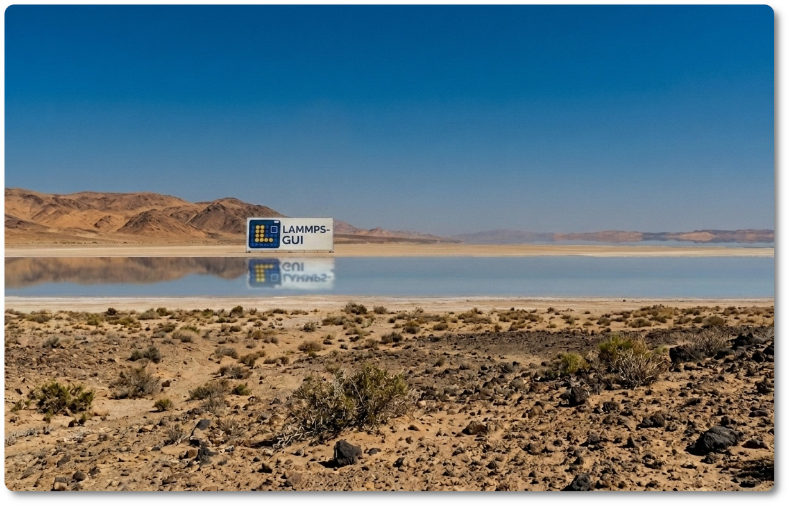

:orphan:

Page Not Found
==============

Sorry, the page you requested does not exist on this server or has moved.

The LAMMPS-GUI documentation changes as the software evolves, so
bookmarks and external links may point to pages that have been renamed,
merged into other pages, or removed since.  Or the link may have just
been mistyped.

Here are some suggestions to find the information you were looking for:

.. links must be absolute URLs: this page is served for missing URLs at
   any depth and relative links would resolve against the missing path

- Go to the `documentation home page </index.html>`_ and navigate to the information you are looking for.
- Look for a suitable entry in the `general index </genindex.html>`_ and follow the link.
- Use the search box in the sidebar to find matching pages.
