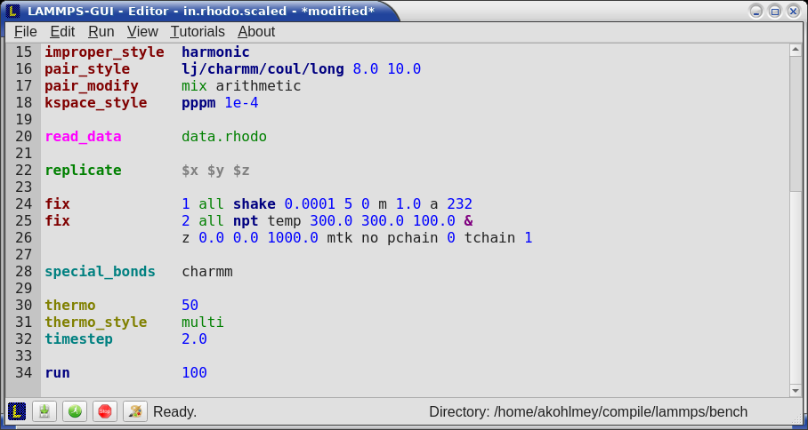
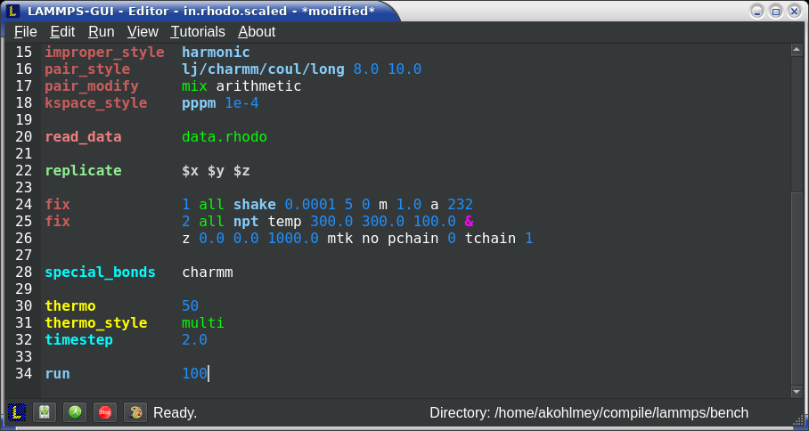
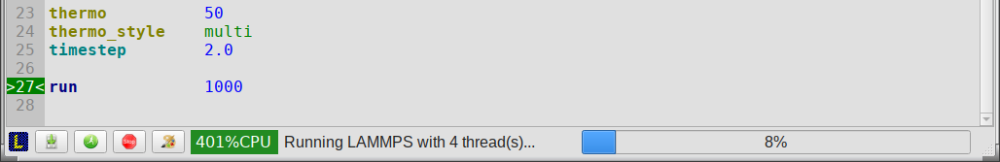
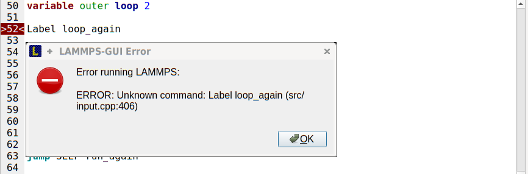

*************************
Basic usage of LAMMPS-GUI
*************************

When LAMMPS-GUI starts, it shows the main window, labeled *Editor*, with
either an empty buffer or the contents of the file used as argument. In
the latter case it may look like the following:

|gui-main1|  |gui-main2|

There is the typical menu bar at the top, then the main editor buffer,
and a status bar at the bottom.  The input file contents are shown
with line numbers on the left and the input is colored according to
the LAMMPS input file syntax.  The status bar shows the status of
LAMMPS execution on the left (e.g. "Ready." when idle) and the current
working directory on the right.  The name of the current file in the
buffer is shown in the window title; the word `*modified*` is added if
the buffer edits have not yet saved to a file.  The geometry of the main
window is stored when exiting and restored when starting again.

Opening and saving files
^^^^^^^^^^^^^^^^^^^^^^^^

The LAMMPS-GUI application can be launched without command-line
arguments and then starts with an empty buffer in the *Editor* window.
If arguments are given LAMMPS will use first command-line argument as
the file name for the *Editor* buffer and reads its contents into the
buffer, if the file exists.  All further arguments are *ignored*.  Files
can also be opened via the *File* menu, the `Ctrl-O` (`Command-O` on
macOS) keyboard shortcut or by drag-and-drop of a file from a graphical
file manager into the editor window.  If a file extension
(e.g. ``.lmp``) has been registered with the graphical environment to
launch LAMMPS-GUI, an existing input file can be launched with
LAMMPS-GUI through double clicking.

Only one file can be edited at a time, so opening a new file with a file
already loaded into the buffer closes that buffer.  If the buffer has
unsaved modifications, you are asked to either cancel the operation,
discard the changes, or save them.  A buffer with modifications can be
saved any time from the "File" menu, by the keyboard shortcut `Ctrl-S`
(`Command-S` on macOS), or by clicking on the "Save" button at the very
left in the status bar.

Running LAMMPS
^^^^^^^^^^^^^^

From within the LAMMPS-GUI main window LAMMPS can be started either from
the *Run* menu using the *Run LAMMPS from Editor Buffer* entry, by the
keyboard shortcut `Ctrl-Enter` (`Command-Enter` on macOS), or by
clicking on the green "Run" button in the status bar.  All of these
operations causes LAMMPS to process the entire input script in the
editor buffer, which may contain multiple `run
<https://docs.lammps.org/run.html>`_ or `minimize
<https://docs.lammps.org/minimize.html>`_ commands.

LAMMPS runs in a separate thread, so the GUI stays responsive and is
able to interact with the running calculation and access data it
produces.  It is important to note that running LAMMPS this way is using
the contents of the input buffer for the run (via the
`lammps_commands_string
<https://docs.lammps.org/Library_execute.html#_CPPv422lammps_commands_stringPvPKc>`_
function of the LAMMPS C-library interface), and **not** the original
file it was read from.  Thus, if there are unsaved changes in the
buffer, they *will* be used.  As an alternative, it is also possible to
run LAMMPS by reading the contents of a file from the *Run LAMMPS from
File* menu entry or with `Ctrl-Shift-Enter`.  This option may be
required in some rare cases where the input uses some functionality that
is not compatible with running LAMMPS from a string buffer.  For
consistency, any unsaved changes in the buffer must be either saved to
the file or undone before LAMMPS can be run from a file.

The line number of the currently executed command is highlighted in
green in the line number display for the *Editor* Window.

While LAMMPS is running, the contents of the status bar change.  The
text fields that normally show "Ready." and the current working
directory, change into an area showing the CPU utilization in percent.
Nest to it is a text indicating that LAMMPS is running, which also
indicates the number of active threads (in case thread-parallel
acceleration was selected in the *Preferences* dialog).  On the right
side, a progress bar is shown that displays the estimated progress for
the current `run <https://docs.lammps.org/run.html>`_ or `minimize
<https://docs.lammps.org/minimize.html>`_ command.

.. admonition:: CPU Utilization
   :class: note

   .. image:: JPG/lammps-gui-buffer-warn.png
      :align: right
      :scale: 75%

   The CPU Utilization should ideally be close to 100% times the number
   of threads like in the screenshot image above.  Since the GUI is
   running as a separate thread, the CPU utilization can be higher, for
   example when the GUI needs to work hard to keep up with the
   simulation.  This can be caused by having frequent thermo output or
   running a simulation of a small system.  In the *Preferences* dialog,
   the polling interval for updating the the *Output* and *Charts*
   windows can be set. The intervals may need to be lowered to not miss
   data between *Charts* data updates or to avoid stalling when the
   thermo output is not transferred to the *Output* window fast enough.
   It is also possible to reduce the amount of data by increasing the
   `thermo interval <https://docs.lammps.org/thermo.html>`_.  LAMMPS-GUI detects, if the
   associated I/O buffer is by a significant percentage and will print a
   warning after the run with suggested adjustments.  The utilization
   can also be lower, e.g.  when the simulation is slowed down by the
   GUI or other processes also running on the host computer and
   competing with LAMMPS-GUI for GPU resources.

If an error occurs (in the example below the command `label
<https://docs.lammps.org/label.html>`_ was incorrectly capitalized as
"Label"), an error message dialog is shown and the line of the input
which triggered the error is highlighted in red.  The state of LAMMPS in
the status bar is set to "Failed."  instead of "Ready."

.. admonition:: Up to three additional windows may open during a run:

   - An :ref:`Output window <logfile>` with the captured screen output from LAMMPS
   - A :ref:`Charts window <charts>` with a line graph created from thermodynamic output of the run
   - A :ref:`Slide Show window <slideshow>` with images created by a `dump image command <https://docs.lammps.org/dump_image.html>`_
     in the input

More information on those windows and how to adjust their behavior and
contents is given in :doc:`the next pages <output>`.

An active LAMMPS run can be stopped cleanly by using either the *Stop
LAMMPS* entry in the *Run* menu, the keyboard shortcut `Ctrl-/`
(`Command-/` on macOS), or by clicking on the red button in the status
bar.  This will cause the running LAMMPS process to complete the current
timestep (or iteration for energy minimization) and then complete the
processing of the buffer while skipping all run or minimize commands.
This is equivalent to the input script command `timer timeout 0
<https://docs.lammps.org/timer.html>`_ and is implemented by calling the
`lammps_force_timeout
<https://docs.lammps.org/Library_utility.html#_CPPv420lammps_force_timeoutPv>`_
function of the LAMMPS C-library interface.  Please see the
corresponding documentation pages to understand the implications of this
operation.
