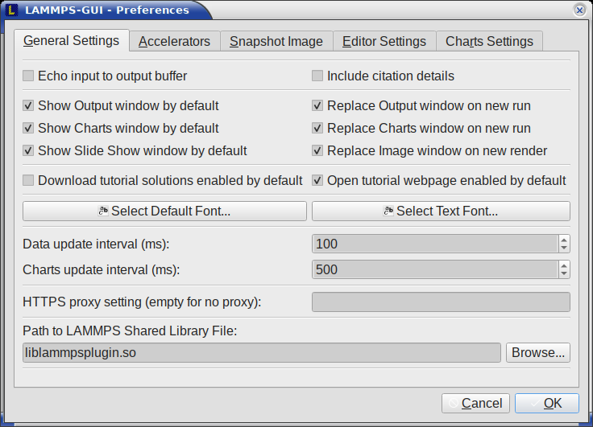
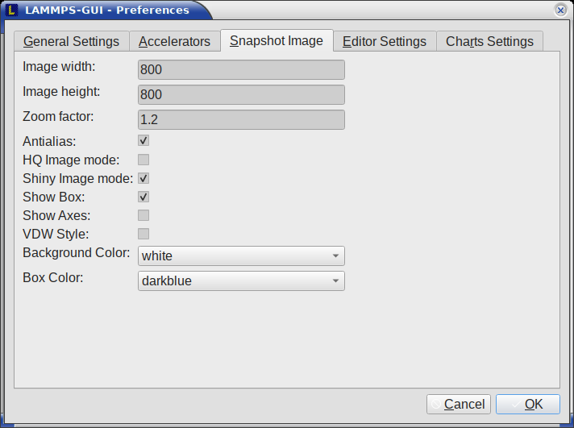

*******
Dialogs
*******

.. index:: dialogs

Find and Replace
----------------

.. index:: Find and Replace dialog
.. index:: dialogs; Find and Replace
.. index:: text search

The *Find and Replace* dialog allows searching for and replacing
text in the *Editor* window.

The dialog can be opened either from the *Edit* menu or with the
keyboard shortcut `Ctrl-F`. You can enter the text to search for.

.. admonition:: Through three check-boxes the search behavior can be adjusted:

   - If checked, "Match case" does a case sensitive search; otherwise
     the search is case insensitive.

   - If checked, "Wrap around" starts searching from the start of the
     document, if there is no match found from the current cursor position
     until the end of the document; otherwise the search will stop.

   - If checked, the "Whole word" setting only finds full word matches
     (white space and special characters are word boundaries).

Clicking on the *Next* button will search for the next occurrence of the
search text and select / highlight it. Clicking on the *Replace* button
will replace an already highlighted search text and find the next one.
If no text is selected, or the selected text does not match the
selection string, then the first click on the *Replace* button will
only search and highlight the next occurrence of the search string.
Clicking on the *Replace All* button will replace all occurrences from
the cursor position to the end of the file; if the *Wrap around* box is
checked, then it will replace **all** occurrences in the **entire**
document.  Clicking on the *Done* button will dismiss the dialog.

------

Preferences
-----------

.. index:: Preferences dialog
.. index:: dialogs; Preferences
.. index:: settings
.. index:: configuration

The *Preferences* dialog allows customization of the behavior and
look of LAMMPS-GUI.  The settings are grouped and each group is
displayed within a tab.

.. |guiprefs2| image:: JPG/lammps-gui-prefs-accel.png
   :width: 19%

.. |guiprefs5| image:: JPG/lammps-gui-prefs-charts.png
   :width: 19%

|guiprefs1|  |guiprefs2|  |guiprefs3|  |guiprefs4|  |guiprefs5|

General Settings:
^^^^^^^^^^^^^^^^^

.. index:: general settings
.. index:: preferences; general

.. admonition:: The following settings are available in this tab:

   - **Echo input to log:** when checked, all input commands, including
     variable expansions, are echoed to the :ref:`Output window <logfile>`. This is
     equivalent to using `-echo screen` at the command-line.  There is no
     log *file* produced by default, since LAMMPS-GUI uses `-log none`.
   - **Include citation details:** when checked full citation info will be
     included to the log window.  This is equivalent to using `-cite
     screen` on the command-line.
   - **Show log window by default:** when checked, the screen output of a
     LAMMPS run will be collected in a log window during the run
   - **Show chart window by default:** when checked, the thermodynamic
     output of a LAMMPS run will be collected and displayed in a chart
     window as line graphs.
   - **Show slide show window by default:** when checked, a slide show
     window will be shown with images from a dump image command, if
     present, in the LAMMPS input.
   - **Replace log window on new run:** when checked, an existing log
     window will be replaced on a new LAMMPS run, otherwise each run will
     create a new log window.
   - **Replace chart window on new run:** when checked, an existing chart
     window will be replaced on a new LAMMPS run, otherwise each run will
     create a new chart window.
   - **Replace image window on new render:** when checked, an existing
     chart window will be replaced when a new snapshot image is requested,
     otherwise each command will create a new image window.
   - **Download tutorial solutions enabled** this controls whether the
     "Download solutions" option is enabled by default when setting up
     a tutorial.
   - **Open tutorial webpage enabled** this controls whether the "Open
     tutorial webpage in web browser" option is enabled by default when
     setting up a tutorial.
   - **Select Default Font:** Opens a font selection dialog where the type
     and size for the default font (used for everything but the editor and
     log) of the application can be set.
   - **Select Text Font:** Opens a font selection dialog where the type and
     size for the text editor and log font of the application can be set.
   - **Data update interval:** Allows to set the time interval between data
     updates during a LAMMPS run in milliseconds.  The default is to update
     the data (for charts and output window) every 10 milliseconds.  This
     is good for many cases.  Set this to 100 milliseconds or more if
     LAMMPS-GUI consumes too many resources during a run.  For LAMMPS runs
     that run *very* fast (for example in tutorial examples), however, data
     may be missed and through lowering this interval, this can be
     corrected.  However, this will make the GUI use more resources.  This
     setting may be changed to a value between 1 and 1000 milliseconds.
   - **Charts update interval:** Allows to set the time interval between redrawing
     the plots in the :ref:`Charts window <charts>` in milliseconds.  The default is to
     redraw the plots every 500 milliseconds.  This is just for the drawing,
     data collection is managed with the previous setting.
   - **HTTPS proxy setting:** Allows to enter a URL for an HTTPS proxy.  This
     may be needed when the LAMMPS input contains `geturl commands
     <https://docs.lammps.org/geturl.html>`_ or for downloading tutorial
     files from the *Tutorials* menu.  If the ``https_proxy`` environment
     variable was set externally, its value is displayed but cannot be
     changed.
   - **Path to LAMMPS Shared Library File:** this option is only visible
     when LAMMPS-GUI was compiled to load the LAMMPS library at run time
     instead of being linked to it directly.  With the *Browse..* button
     or by changing the text, a different shared library file with a
     different compilation of LAMMPS with different settings or from a
     different version can be loaded.  After this setting was changed,
     LAMMPS-GUI needs to be re-launched.

Accelerators:
^^^^^^^^^^^^^

.. index:: accelerators
.. index:: preferences; accelerators
.. index:: GPU acceleration
.. index:: thread parallelization

This tab enables selection of an accelerator package and modification of
some of its settings for use when running LAMMPS. This is equivalent to
using the `-sf <https://docs.lammps.org/suffix.html>`_ and `-pk
<https://docs.lammps.org/package.html>`_ flags `on the command-line
<https://docs.lammps.org/Run_options.html>`_.  Only settings supported
by the LAMMPS library and local hardware are available.  The `Number of
threads` field allows setting the number of threads for the accelerator
packages that support using threads (OPENMP, INTEL, KOKKOS, and GPU).
Furthermore, the choice of precision mode (double, mixed, or single) for
the INTEL package can be selected, and for the GPU package, whether the
neighbor lists are built on the GPU or the host (required for `pair
style hybrid <https://docs.lammps.org/pair_hybrid.html>`_) and whether
only pair styles should be accelerated (i.e., run PPPM entirely on the
CPU, which sometimes leads to better overall performance).  Whether
settings can be changed depends on which accelerator package is chosen
(or "None").

Snapshot Image:
^^^^^^^^^^^^^^^

.. index:: snapshot image settings
.. index:: preferences; snapshot image
.. index:: image rendering

This tab allows setting defaults for the snapshot images displayed in
the :ref:`Image Viewer window <snapshot_viewer>`, such as its dimensions
and the zoom factor applied.  The **Antialias** switch will render images
with twice the number of pixels for width and height and then smoothly
scale the image back to the requested size.  This produces higher
quality images with smoother edges at the expense of requiring more CPU
time to render the image.  The **HQ Image mode** option turns on screen
space ambient occlusion (SSAO) mode when rendering images.  This is also
more time consuming, but produces a more 'spatial' representation of the
system with shading of atoms by their depth.  The **Shiny Image mode** option
will render objects with a shiny surface when enabled.  Otherwise, the
surfaces will be matte.  The **Show Box** option selects whether the
system box is drawn as a colored set of sticks.  Similarly, the **Show
Axes** option selects whether a representation of the three system axes
will be drawn as colored sticks. The **VDW Style** checkbox selects
whether atoms are represented by space filling spheres when checked or
by smaller spheres and sticks.  Finally, there are a couple of drop down
lists to select the background and box colors.

Editor Settings:
^^^^^^^^^^^^^^^^

.. index:: editor settings
.. index:: preferences; editor
.. index:: code formatting preferences

This tab allows tweaking settings of the :ref:`editor window <editor>`.
Specifically, the amount of padding to be added to LAMMPS commands,
types or type ranges, IDs (e.g., for fixes), and names (e.g., for groups).
The value set is the minimum width for the text element and it can be
chosen in the range between 1 and 32.

The three settings which follow enable or disable the automatic
reformatting when hitting the 'Enter' key, the automatic display of
the completion pop-up window, and whether auto-save mode is enabled.
In auto-save mode the editor buffer is saved before a run or before
exiting LAMMPS-GUI.

Charts Settings:
----------------

.. index:: charts settings
.. index:: preferences; charts
.. index:: plotting preferences

This tab allows tweaking settings of the :ref:`Charts window <charts>`.
Specifically, one can set the default chart title (if the title contains
'%f' it will be replaced with the name of the current input file), one
can select whether by default the raw data, the smoothed data, or both
will be plotted, one can set the colors for the two lines, the default
smoothing parameters, and the default size of the chart graph in pixels.
