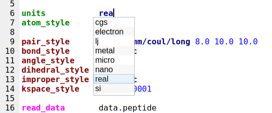
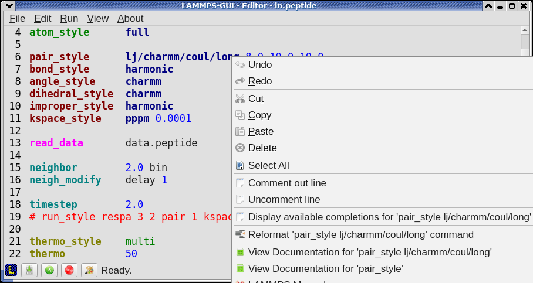
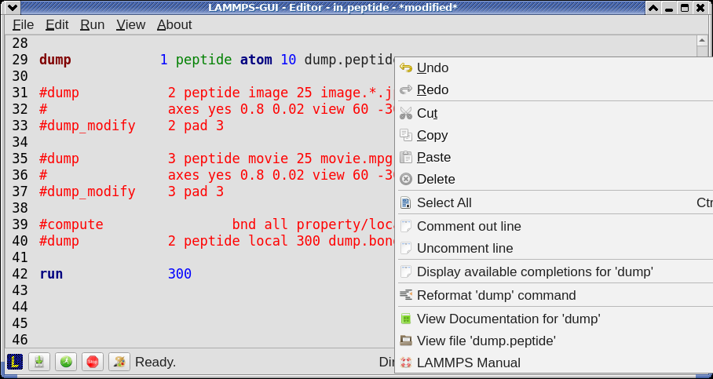
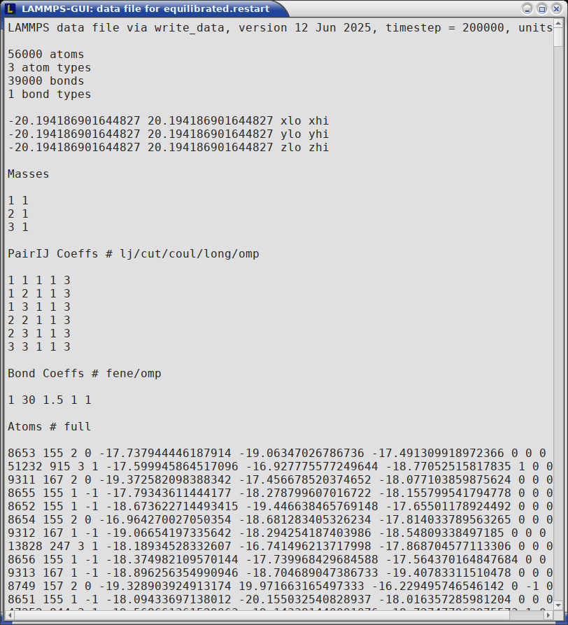
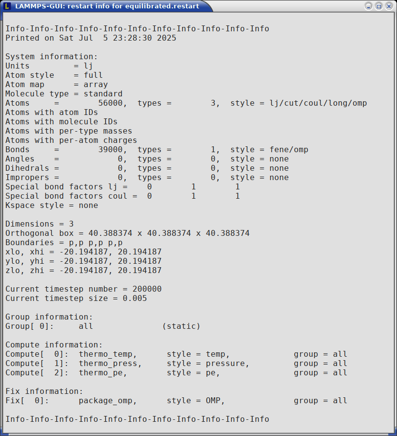
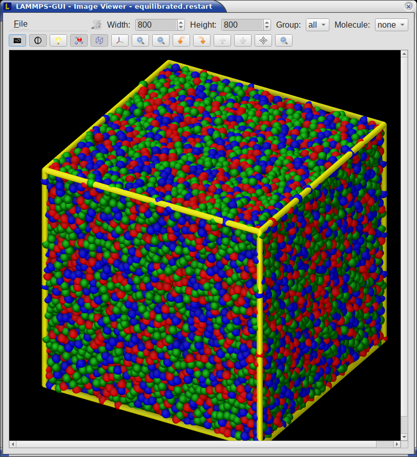

*************
Editor Window
*************

The *Editor* window of LAMMPS-GUI has most of the usual functionality
that similar programs have: text selection via mouse or with cursor
moves while holding the Shift key, Cut (`Ctrl-X`), Copy (`Ctrl-C`),
Paste (`Ctrl-V`), Undo (`Ctrl-Z`), Redo (`Ctrl-Shift-Z`), Select All
(`Ctrl-A`).  When trying to exit the editor with a modified buffer, a
dialog will pop up asking whether to cancel the exit operation, or to
save or not save the buffer contents to a file.

The editor has an auto-save mode that can be enabled or disabled in the
*Preferences* dialog.  In auto-save mode, the editor buffer is
automatically saved before running LAMMPS or before exiting LAMMPS-GUI.

Context Specific Word Completion
^^^^^^^^^^^^^^^^^^^^^^^^^^^^^^^^

By default, LAMMPS-GUI displays a small pop-up frame with possible
choices for LAMMPS input script commands or styles after 2 characters of
a word have been typed.

The word can then be completed through selecting an entry by scrolling
up and down with the cursor keys and selecting with the 'Enter' key or
by clicking on the entry with the mouse.  The automatic completion
pop-up can be disabled in the *Preferences* dialog, but the completion
can still be requested manually by either hitting the 'Shift-TAB' key or
by right-clicking with the mouse and selecting the option from the
context menu.  Most of the completion information is retrieved from the
active LAMMPS instance and thus it shows only available options that
have been enabled when compiling LAMMPS. That list, however, excludes
accelerated styles and commands; for improved clarity, only the
non-suffix version of styles are shown.

Line Reformatting
^^^^^^^^^^^^^^^^^

The editor supports reformatting lines according to the syntax in order
to have consistently aligned lines.  This primarily means adding
whitespace padding to commands, type specifiers, IDs and names.  This
reformatting is performed manually by hitting the 'Tab' key.  It is
also possible to have this done automatically when hitting the 'Enter'
key to start a new line.  This feature can be turned on or off in the
*Preferences* dialog for *Editor Settings* with the
"Reformat with 'Enter'" checkbox. The amount of padding for multiple
categories can be adjusted in the same dialog.

Internally this functionality is achieved by splitting the line into
"words" and then putting it back together with padding added where the
context can be detected; otherwise a single space is used between words.

Context Specific Help
^^^^^^^^^^^^^^^^^^^^^

|gui-popup1|  |gui-popup2|

A unique feature of LAMMPS-GUI is the option to look up the LAMMPS
documentation for the command in the current line.  This can be done by
either clicking the right mouse button or by using the `Ctrl-?` keyboard
shortcut.  When using the mouse, there are additional entries in the
context menu that open the corresponding documentation page in the
online LAMMPS documentation in a web browser window.  When using the
keyboard, the first of those entries is chosen.

If the word under the cursor is a file, then additionally the context
menu has an entry to open the file in a read-only text viewer window.
If the file is a LAMMPS restart file, instead the menu entry offers to
:ref:`inspect the restart <inspect_restart>`.

The text viewer is a convenient way to view the contents of files that
are referenced in the input.  The file viewer also supports on-the-fly
decompression based on the file name suffix in a `similar fashion as
available with LAMMPS
<https://docs.lammps.org/Build_settings.html#read-or-write-compressed-files>`_.
If the necessary decompression program is missing or the file cannot be
decompressed, the viewer window will contain a corresponding message.

.. _inspect_restart:

Inspecting a Restart file
^^^^^^^^^^^^^^^^^^^^^^^^^

When LAMMPS-GUI is asked to "Inspect a Restart", it will read the
restart file into a LAMMPS instance and then open three different
windows.  The first window is a text viewer with the output of an `info
command <https://docs.lammps.org/info.html>`_ with system information
stored in the restart.  The second window is text viewer containing a
data file generated with a `write_data command
<https://docs.lammps.org/write_data.html>`_.  The third window is a
:ref:`Snapshot Image Viewer <snapshot_viewer>` containing a
visualization of the system in the restart.

|inspect1|  |inspect2|  |inspect3|

.. admonition:: Large Restart Files
   :class: warning

   If the restart file is larger than 250 MBytes, a dialog will ask for
   confirmation before continuing, since large restart files may require
   large amounts of RAM since the entire system must be read into RAM.
   Thus restart file for large simulations that have been run on an HPC
   cluster may overload a laptop or local workstation. The *Show
   Details...* button will display a rough estimate of the additional
   memory required.

