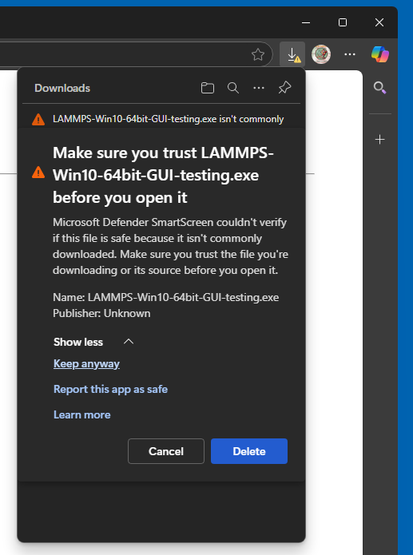
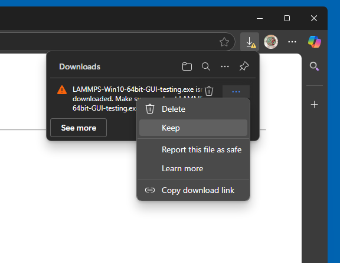
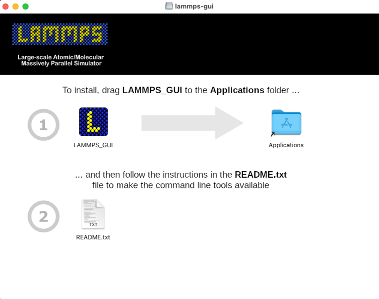
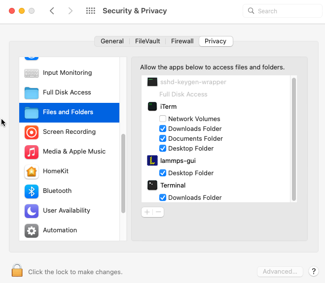
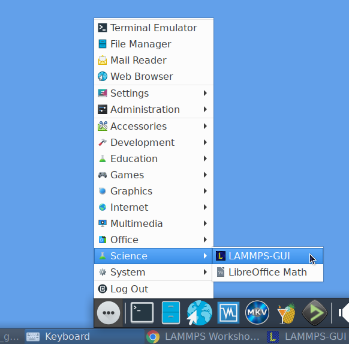

************
Installation
************

LAMMPS-GUI is distributed as `source code on GitHub
<https://github.com/akohlmey/lammps-gui>`_ and can be compiled as part
of compiling LAMMPS, where it will be linked to the corresponding
version of LAMMPS directly.  Pre-compiled packages of LAMMPS with
LAMMPS-GUI included are available for download (see below).

LAMMPS-GUI can also be compiled as a standalone package and load the
LAMMPS library dynamically at runtime.  This enables using LAMMPS-GUI
with customized, patched, or extended LAMMPS versions containing
features not available in the official LAMMPS distribution packages.  It
also supports using LAMMPS-GUI with LAMMPS shared libraries compiled
using the traditional makefile based build process.  Pre-compiled
packages of standalone LAMMPS-GUI versions *without* LAMMPS included are
also available for download (see below).

Prerequisites and portability
^^^^^^^^^^^^^^^^^^^^^^^^^^^^^

LAMMPS-GUI is programmed in C++ based on the
C++17 standard and using the `Qt GUI framework
<https://www.qt.io/product/framework>`_.  Currently, Qt version 5.15LTS
or later is required; support for Qt version 6.x is available, too.
When compiled With Qt version 6.x, LAMMPS-GUI can switch between a
"light" and a "dark" theme according to the settings of the desktop
environment.  Otherwise, there are no changes in functionality between
using either major version of Qt.  Building LAMMPS-GUI requires CMake
version 3.20 or later.

.. admonition:: LAMMPS-GUI has been successfully compiled and tested on:

   - Ubuntu Linux 22.04LTS x86_64 using GCC 11, Qt version 5.15
   - Fedora Linux 41 x86\_64 using GCC 14 and Clang 17, Qt version 5.15
   - Fedora Linux 42 x86\_64 using GCC 15, Qt version 6.9
   - Apple macOS 12 (Monterey) and macOS 13 (Ventura) with Xcode on arm64 and x86\_64, Qt version 5.15
   - Windows 10 and 11 x86_64 with Visual Studio 2022 and Visual C++ 14.36, Qt version 5.15
   - Windows 10 and 11 x86_64 with Visual Studio 2022 and Visual C++ 14.40, Qt version 6.7
   - Windows 10 and 11 x86_64 with MinGW / GCC 14.2 cross-compiler on Fedora 42, Qt version 5.15

Pre-compiled executables
^^^^^^^^^^^^^^^^^^^^^^^^

Packages including LAMMPS
-------------------------

For many users and especially for beginners learning to use LAMMPS, it
is most convenient to install and use one of the pre-compiled packages
that include both, LAMMPS-GUI and the command-line version of LAMMPS.
Such pre-compiled LAMMPS executable packages are available for download
for Linux x86\_64 (Ubuntu 22.04LTS or later and compatible), macOS
(version 11 aka Big Sur or later), and Windows (version 10 or later)
from the `LAMMPS releases page on GitHub
<https://github.com/lammps/lammps/releases/>`_.  A backup download
location is at https://download.lammps.org/static/ but may not always be
up-to-date.  Occasionally, also test version packages previewing
recently added features are available at
https://download.lammps.org/testing/ .

Standalone packages without LAMMPS
----------------------------------

LAMMPS-GUI packages compiled in plugin mode are also available from the
`LAMMPS-GUI releases page on GitHub
<https://github.com/akohlmey/lammps-gui/releases>`_.  These packages do
not include LAMMPS and thus need to find a suitable LAMMPS shared
library to be functional.  By default, it will look in a few places for
it (current directory, folders in LD_LIBRARY_PATH, DYLD_LIBRARY_PATH,
some system folders) and stop with an error, if no suitable library
could be found.

In that case, or if you want to override the default choice, you can use
the ``-p`` command line flag to tell LAMMPS-GUI which LAMMPS
shared library file you want it to load.  By using ``-p ""`` you
can also reset any previous choice and trigger the automated search
again.  Once LAMMPS-GUI is running, you can also change the path from
the :doc:`Preferences dialog <dialogs>`.

GPU support and MPI parallelization
-----------------------------------

The pre-compiled packages include support for GPUs through the GPU
package with OpenCL (in mixed precision).  However, this requires
that you have a compatible driver and the OpenCL runtime installed.
This is not always available and when using the flatpak package, the
flatpak sandbox prevents accessing the GPU.  GPU support through
the KOKKOS package is currently not available for technical reasons,
but serial and OpenMP multi-threading use of KOKKOS is available.

The design decisions for LAMMPS-GUI and how it launches LAMMPS
conflict with parallel runs using MPI.  You have to `use a regular
LAMMPS executable <https://docs.lammps.org/Run_basics.html>`_
compiled with MPI support for that.  For the use cases that
LAMMPS-GUI has been conceived for this is not a significant
limitation.  Many supercomputing centers and high-performance
computing clusters have parallel LAMMPS pre-installed.

Platform notes
--------------

Windows 10 and later
""""""""""""""""""""

After downloading the ``LAMMPS-Win10-64bit-GUI-<version>.exe`` installer
package, you need to execute it, and start the installation process.
Depending on your security settings of your web browser, you may have to
explicitly tell it to download the file and then confirm **twice** to
*keep the downloaded file* despite the claims that it may be dangerous
and insecure.  Since the installer packages are currently not
cryptographically signed, you may also have to enable "Developer Mode"
in the Windows System Settings to be able to run the installer.

MacOS 11 and later
""""""""""""""""""

After downloading the ``LAMMPS-macOS-multiarch-GUI-<version>.dmg``
application bundle disk image, you need to double-click it and then, in
the window that opens, drag the app bundle as indicated into the
"Applications" folder.  Afterwards, the disk image can be unmounted.
Then follow the instructions in the "README.txt" file to get access to
the other included command-line executables.

|macos1| |macos2|

Linux on x86\_64
""""""""""""""""

For Linux with x86\_64 CPU there are currently two variants of
pre-compiled packages. The first is compiled on Ubuntu 22.04LTS, is
using some wrapper scripts, and should be compatible with most recent
Linux distributions.  After downloading and unpacking the
``LAMMPS-Linux-x86_64-GUI-<version>.tar.gz`` package, you can switch
into the "LAMMPS_GUI" folder and execute "./lammps-gui" directly:

.. code-block:: bash

   $ cd ~/Downloads
   $ tar -xzvvf LAMMPS-Linux-x86_64-GUI-22Jul2025.tar.gz
   $ cd LAMMPS_GUI
   $ ./lammps-gui &

The ``LAMMPS_GUI`` folder may also be moved around and added to the
``PATH`` environment variable so the executables will be found
automatically.

The second Linux package variant uses `flatpak
<https://www.flatpak.org>`_ and requires the flatpak management and
runtime software to be installed.  After downloading the
``LAMMPS-GUI-Linux-x86_64-GUI-<version>.flatpak`` flatpak bundle, you
can install it with:

.. code-block:: bash

   $ cd ~/Downloads
   $ flatpak install --user LAMMPS-GUI-Linux-x86_64-GUI-<version>.flatpak

After installation, LAMMPS-GUI should be integrated into your desktop
environment under "Applications > Science" but also can be launched from
the console with ``flatpak run org.lammps.lammps-gui``.  The flatpak
bundle also includes the console LAMMPS executable ``lmp`` which can be
launched to run simulations with, for example with:

.. code-block:: sh

   flatpak run --command=lmp org.lammps.lammps-gui -in in.melt

Other bundled command-line executables are run the same way and can be
listed with:

.. code-block:: sh

   ls $(flatpak info --show-location org.lammps.lammps-gui )/files/bin

---------------

Compilation from source
^^^^^^^^^^^^^^^^^^^^^^^

The source for LAMMPS-GUI was included with the LAMMPS source code
distribution until LAMMPS version 22 July 2025 in the folder
``tools/lammps-gui``.  Starting with version 1.8.0, the LAMMPS-GUI
sources are distributed separately through its own git repository at
https://github.com/akohlmey/lammps-gui.

LAMMPS-GUI can still be built as part of a regular LAMMPS
compilation.  It will be automatically downloaded from its git
repository and configured.  This is usually the most convenient way.
Since `CMake <https://docs.lammps.org/Howto_cmake.html>`_ is *required*
to build LAMMPS-GUI, you need to build LAMMPS with CMake as well.  To
enable its compilation during compiling LAMMPS, the CMake variable ``-D
BUILD_LAMMPS_GUI=on`` must be set when creating the CMake configuration.
All other settings (compiler, flags, compile type) for LAMMPS-GUI are
then inherited from the regular LAMMPS build.  If the Qt library is
installed as packaged for Linux distributions, then its location is
typically auto-detected since the required CMake configuration files are
stored in a location where CMake can find them without additional help.
Otherwise, the location of the Qt library installation must be indicated
by setting ``-D Qt5_DIR=/path/to/qt5/lib/cmake/Qt5``, which is a path to
a folder inside the Qt installation that contains the file
``Qt5Config.cmake``. Similarly, for Qt6 the location of the Qt library
installation can be indicated by setting ``-D
Qt6_DIR=/path/to/qt6/lib/cmake/Qt6``, if necessary.  When both, Qt5 and
Qt6 are available, Qt6 will be preferred unless ``-D
LAMMPS_GUI_USE_QT5=yes`` is set.

LAMMPS-GUI plugin version
-------------------------

It is possible to compile a standalone LAMMPS-GUI executable (e.g. when
LAMMPS has been compiled with traditional make).  Rather than linking to
the LAMMPS library during compilation, it includes a `plugin loader
<https://github.com/akohlmey/lammps-gui/tree/main/plugin>`_ that will
load a LAMMPS shared library file dynamically at runtime during the
start of the GUI; e.g. ``liblammps.so.0`` or ``liblammps.0.dylib`` or
``liblammps.dll`` (depending on the operating system).  This has the
advantage that the LAMMPS library can be built from updated or modified
LAMMPS source without having to (re-)compile the GUI.

The ABI of the LAMMPS C-library interface is very stable and generally
backward compatible.  However, features used in LAMMPS-GUI may require a
minimum LAMMPS version of the library.  LAMMPS-GUI will print a suitable
error message and exit if an incompatible LAMMPS library is loaded.  You
can override the path to the LAMMPS library with the ``-p <path>`` or
``--pluginpath <path>`` command-line flag.  This is usually
auto-detected on the first run and can be changed in the LAMMPS-GUI
*Preferences* dialog.  The command-line flag allows to reset this path
to a valid value in case the original setting has become invalid.  An
empty path ("") as argument restores the default setting.

It is also possible to link the standalone compiled LAMMPS-GUI version
to the LAMMPS library directly.  This feature is enabled by setting ``-D
LAMMPS_GUI_USE_PLUGIN=off`` (default setting is on).  This is also the
setting for compilation within LAMMPS.  In this case, the CMake
configuration needs to be told where to find the LAMMPS headers and the
LAMMPS library, via ``-D LAMMPS_SOURCE_DIR=/path/to/lammps/src``.

Platform notes
--------------

macOS
"""""

When building on macOS, the build procedure will try to manufacture a
drag-n-drop installer, ``LAMMPS-GUI-macOS-multiarch-<version>.dmg``,
when using the 'dmg' target (i.e. ``cmake --build <build dir> --target
dmg`` or ``make dmg``.

To build multi-arch executables that will run on both, arm64 and x86_64
architectures natively, it is necessary to set the CMake variable ``-D
CMAKE_OSX_ARCHITECTURES=arm64;x86_64``.  To achieve wide compatibility
with different macOS versions, you can also set ``-D
CMAKE_OSX_DEPLOYMENT_TARGET=11.0`` which will set compatibility to macOS
11 (Big Sur) and later, even if you are compiling on a more recent macOS
version.

Windows
"""""""

On Windows either native compilation from within Visual Studio 2022 with
Visual C++ is supported and tested, or compilation with the MinGW / GCC
cross-compiler environment on Fedora Linux.

*Visual Studio*

Using CMake and Ninja as build system are required.  Qt needs to be
installed, tested was a binary Qt package downloaded from
https://www.qt.io, which installs into the ``C:\\Qt`` folder by default.
There is a custom `x64-GUI-MSVC` build configuration provided in the
``CMakeSettings.json`` file that Visual Studio uses to store different
compilation settings for project.  Choosing this configuration will
activate building the `lammps-gui.exe` executable in addition to LAMMPS
through importing package selection from the ``windows.cmake`` preset
file and enabling building LAMMPS-GUI and disabling building with
MPI.  When requesting an installation from the `Build` menu in Visual
Studio, it will create a compressed ``LAMMPS-GUI-Win10-amd64.zip`` zip file
with the executables and required dependent .dll files.  This zip file
can be uncompressed and ``lammps-gui.exe`` run directly from there.  The
uncompressed folder can be added to the ``PATH`` environment and LAMMPS
and LAMMPS-GUI can be launched from anywhere from the command-line.

*MinGW64 Cross-compiler*

The standard CMake build procedure for cross-compilation can be applied.
By using the ``mingw64-cmake`` wrapper the CMake configuration will
automatically include a suitable CMake toolchain file (the regular cmake
command can be used after that to modify the configuration settings, if
needed).  After building the libraries and executables, you can build
the target 'zip' (i.e. ``cmake --build <build dir> --target zip`` or
``make zip`` to stage all installed files into a LAMMPS_GUI folder and
then run a script to copy all required dependencies, some other files,
and create a zip file from it.

Linux
"""""

*Binary tarball package*

Version 5.15 or later of the Qt library is required. Those are provided
by, e.g., Ubuntu 22.04LTS or later.  Thus older Linux distributions are
not likely to be supported, while more recent ones will work, even for
pre-compiled executables (see above).  After compiling with
``cmake --build <build folder>``, use ``cmake --build <build
folder> --target tgz`` or ``make tgz`` to build a
``LAMMPS-Linux-amd64.tar.gz`` file with the executables and their
support libraries.

**Flatpak bundle**

It is also possible to build a `flatpak bundle
<https://docs.flatpak.org/en/latest/single-file-bundles.html>`_ which is
a way to distribute applications in a way that is compatible with most
Linux distributions (provided the flatpak system is installed).  Use the
"flatpak" target to trigger a compile (``cmake --build <build
folder> --target flatpak`` or ``make flatpak``).  Please note that this
will not build from the local sources but from the repository and branch
listed in the ``org.lammps.lammps-gui.yml`` LAMMPS-GUI source folder.
Flatpak builds are currently only supported when building LAMMPS-GUI
from within LAMMPS due to restrictions imposed by the flatpak sandbox.
