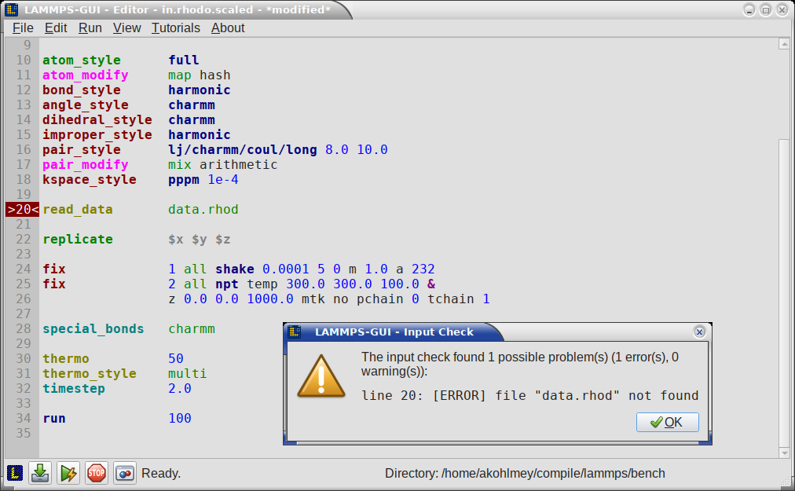
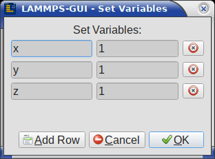
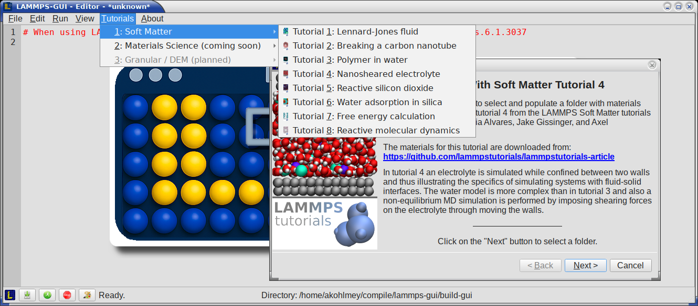

*****
Menus
*****

.. index:: menus
.. index:: menu bar
.. index:: keyboard shortcuts

The menu bar has entries *File*, *Edit*, *Run*, *View*, *Tutorials*, and
*About*.  Instead of using the mouse to click on them, the individual
menus can also be activated by hitting the `Alt` key together with the
corresponding underlined letter, that is `Alt-F` activates the
*File* menu.  For the corresponding activated sub-menus, the key
corresponding to the underlined letters can be used to select entries
instead of using the mouse.

.. _files:

File
^^^^

.. index:: File menu
.. index:: menus; File

.. admonition:: The *File* menu offers the usual options:

   - *New Input File* clears the current buffer and resets the file name to ``*unknown*``
   - *Open Input File* opens a dialog to select a new file for editing in the *Editor*
   - *Save Input File* saves the current file; if the file name is ``*unknown*``
     a dialog will open to select a new file name
   - *Save Input File As* opens a dialog to select a new file name (and folder, if
     desired) and saves the buffer to it.  Writing the buffer to a different folder
     will also switch the current working directory to that folder.
   - *View Text File* opens a dialog to select a file for viewing in a *separate*
     window (read-only) with support for on-the-fly decompression as explained
     above.  If the selected file appears to be an image, a movie, or a binary file,
     a warning is shown instead; use *View Image or Movie File(s)...* for those.
   - *View Image or Movie File(s)...* opens a dialog to select one or more image files
     and shows them together in a standalone :ref:`slide show <slideshow>` window.  This is
     useful for reviewing images created by an external (e.g. large parallel) simulation,
     or for revisiting images from an earlier run without rerunning it.  Image formats
     that Qt cannot read natively are converted on demand with
     `ImageMagick <https://imagemagick.org/>`_ if it is available, and each file is
     converted only once.  Movie files may be selected as well: their frames are
     extracted into individual images with `FFmpeg <https://ffmpeg.org/>`_ after
     confirming a dialog that also selects the frame range and interval, as explained
     under :ref:`Importing movie files <movie_import>`.
   - *Plot Data File...* opens a dialog to select a file with column-oriented numeric
     data and plots it in a standalone :ref:`Charts window <charts>` without running a
     simulation.  See the description below for details.
   - *Inspect Restart File* opens a dialog to select a file.  If that file is a
     `LAMMPS restart <https://docs.lammps.org/write_restart.html>`_ three
     windows with :ref:`information about the file are opened
     <inspect_restart>`.
   - *Write Restart File...* opens a dialog to select a file name and then
     writes a `LAMMPS restart file
     <https://docs.lammps.org/write_restart.html>`_ with the current state
     of the system.  This requires a system state, e.g. from running an
     input.  A typical use case is to preserve the state of a run that was
     interrupted with the *Stop LAMMPS* entry of the :ref:`Run menu
     <run_menu>` before extending it.
   - *Quit* exits LAMMPS-GUI. If there are unsaved changes, a dialog will
     appear to either cancel the operation, or to save, or to not save the
     modified buffer.

In addition, up to 5 recent file names will be listed after the *Open Input File*
entry that allows re-opening recently opened files.  This list is stored
when quitting and recovered when starting again.

.. versionadded:: 2.1

   The *View Image File(s)...* and *Plot Data File...* entries were added.  The
   *View Text File* entry now warns when given an image or binary file instead of
   trying to display it as text.

.. versionchanged:: 3.0.2

   The *View Image File(s)...* entry was renamed to *View Image or Movie
   File(s)...* and now also accepts movie files.

.. versionadded:: 3.0.6

   The *Write Restart File...* entry was added.

**Plotting external data files.** The *Plot Data File...* entry
(`Ctrl-Shift-P`) opens a dialog to select a file with column-oriented
numeric data and plots it in a standalone :ref:`Charts window <charts>`
without running a simulation.  Supported formats are whitespace-separated
columns (``.dat``), comma-separated values (``.csv``), `YAML
<https://yaml.org/>`_ (including the segmented thermo output that LAMMPS
itself writes), and `JSON <https://www.json.org/>`_; the format is
recognized from the file name extension or, failing that, from the
content.  After the file is read, a dialog lets you pick which column
provides the x axis and which columns to plot; column names can also be
edited at this point.  Because there is no associated simulation, the
*Units* and *Norm* controls are hidden in such a standalone chart window.
All the post-processing and export features described for the
:ref:`Charts window <charts>` are available here as well.

Edit
^^^^

.. index:: Edit menu
.. index:: menus; Edit
.. index:: Find and Replace

The *Edit* menu offers the usual editor functions like *Undo*, *Redo*,
*Cut*, *Copy*, *Paste*, and a *Find and Replace* dialog (keyboard
shortcut `Ctrl-F`).  It can also open a *Preferences* dialog (keyboard
shortcut `Ctrl-P`) and allows deleting all stored preferences and
settings, so they are reset to their default values.  Resetting the
preferences also deletes a LAMMPS shared library that was previously
downloaded into the configuration folder; the library files for all
supported platforms are removed in case the configuration folder is
shared between multiple computers.

.. _run_menu:

Run
^^^

.. index:: Run menu
.. index:: menus; Run
.. index:: LAMMPS execution
.. index:: LAMMPS library interface

The *Run* menu has options to start and stop a LAMMPS process.  Rather
than calling the LAMMPS executable as a separate executable, the
LAMMPS-GUI is linked to the LAMMPS library and thus can run LAMMPS
internally through the `LAMMPS C-library interface
<https://docs.lammps.org/Library.html#lammps-c-library-api>`_ in a
separate thread.

Specifically, a LAMMPS instance will be created by calling
`lammps_open_no_mpi
<https://docs.lammps.org/Library_create.html#_CPPv418lammps_open_no_mpiiPPcPPv>`_
(through the ``LammpsWrapper`` C++ adapter).  The buffer contents are
then executed by calling `lammps_commands_string
<https://docs.lammps.org/Library_execute.html#_CPPv422lammps_commands_stringPvPKc>`_.
Certain commands and features are only available after a LAMMPS instance
is created.  Its presence is indicated by a small LAMMPS ``L`` logo in
the status bar at the bottom left of the main window.  As an
alternative, it is also possible to run LAMMPS using the contents of the
edited file by reading the file.  This is mainly provided as a fallback
option in case the input uses some feature that is not available when
running from a string buffer.

The LAMMPS calculations are run in a concurrent thread so that the GUI
can stay responsive and be updated during the run.  The GUI can retrieve
data from the running LAMMPS instance and tell it to stop at the next
timestep.  The *Stop LAMMPS* entry will do this by calling the
`lammps_force_timeout
<https://docs.lammps.org/Library_utility.html#_CPPv420lammps_force_timeoutPv>`_
library function, which is equivalent to a `timer timeout 0
<https://docs.lammps.org/timer.html>`_ command.

.. versionadded:: 3.0.6

   The *Extend Run...* entry was added.

The *Extend Run...* entry (keyboard shortcut `Ctrl-E`) opens a dialog
asking for a number of steps and then continues the previous run for
that many more steps without clearing the system.  This requires a
system state, e.g. from a previous run or an inspected restart file.
The continuation executes a `timer timeout off
<https://docs.lammps.org/timer.html>`_ command, which resets the
expired timer in case the previous run was interrupted with *Stop
LAMMPS*, followed by ``run <steps> pre yes post no``.  The captured
output and thermodynamic data are appended to the existing *Output*
and *Charts* windows after a message noting the extension.  Typical
use cases are continuing a run that was stopped (e.g. after writing a
restart file first), or extending a run that did not produce enough
frames for a smooth animation or enough data for a plot.

The *Relaunch LAMMPS Instance* will destroy the current LAMMPS thread
and free its data and then create a new thread with a new LAMMPS
instance.  This is usually not needed, since LAMMPS-GUI tries to detect
when this is needed and does it automatically.  This is available
in case it missed something and LAMMPS behaves in unexpected ways.

.. index:: Check Input

.. versionadded:: 3.0.6

The *Check Input via Heuristics* entry (keyboard shortcut `Ctrl-K`)
runs a fast static check of the editor buffer and reports its findings
in a dialog: unknown commands and style names (validated against the
loaded LAMMPS library), unbalanced quotes, dangling line continuations,
variables used before they are defined, references to undefined groups,
references to computes, fixes, or variables that are defined nowhere in
the buffer, missing input files, missing required arguments, and
non-numeric arguments where strictly numeric values are required.  When
no problems are found, a corresponding message is shown; otherwise the
cursor moves to the first finding.  The same check runs automatically
before every run (this can be disabled in the *Editor Settings* of the
*Preferences* dialog); in that case only error-level findings trigger a
dialog asking whether to run anyway, while warnings are only noted in
the status bar.  The checker is designed to avoid false alarms: any
word containing a ``$`` substitution is exempt from checking, and
script features that make static analysis unreliable (include files,
jump loops, if/then commands, python scripting, shell commands, restart
files, runtime plugins) disable the affected groups of checks.

.. versionadded:: 3.0.6

The *Check Input via Dry Run* entry (keyboard shortcut `Ctrl-Shift-K`)
validates the buffer by actually executing it: the equivalent of the
`-skiprun <https://docs.lammps.org/Run_options.html>`_ command-line
flag is applied, so LAMMPS parses every command and executes the setup
phase of every `run <https://docs.lammps.org/run.html>`_ and `minimize
<https://docs.lammps.org/minimize.html>`_ command without computing any
timesteps.  This is a much deeper check than the static one, but it
takes as long as the setup of a real run and has the same side
effects: output files may be created or overwritten and `shell
<https://docs.lammps.org/shell.html>`_ commands are executed, which is
why the action first asks for confirmation.  The captured output is
shown in an *Output* window; errors are reported with the usual error
dialog and the offending line is highlighted in the editor.  On
success, a dialog confirms that the input passed and points to the
*Output* window for any LAMMPS warnings.

.. _set_variables:

The *Set Variables...* entry opens a dialog box where `index style
variables <https://docs.lammps.org/variable.html>`_ can be set. Those
variables are passed to the LAMMPS instance when it is created and are
thus set *before* a run is started.

The *Set Variables* dialog will be pre-populated with entries that
are set as index variables in the input and any variables that are
used but not defined, if the built-in parser can detect them.  New
rows for additional variables can be added through the *Add Row*
button and existing rows can be deleted by clicking on the *X* icons
on the right.

.. versionchanged:: 3.0.6

   The dialog follows edits to the input script: when a ``variable ...
   index`` command in the editor is changed, the dialog picks up the
   new value the next time it is opened or a run is started, even if
   the value had been changed in the dialog before.  A value edited in
   the dialog so that it differs from the input script is shown in
   bold with a tooltip listing the script value, and the overridden
   value in the editor is surrounded by a thin frame as a reminder
   that the input script line is not what LAMMPS will use.  Values
   from the dialog are passed to LAMMPS before the input script runs,
   so they take precedence over ``variable ... index`` commands in the
   input, exactly like the ``-var`` command line flag to LAMMPS.

The *Create Image* entry will send a `dump image
<https://docs.lammps.org/dump_image.html>`_ command to the LAMMPS
instance, read the resulting file, and show it in an *Image Viewer*
window.

The *View in OVITO* entry will launch `OVITO <https://ovito.org>`_ with
a `data file <https://docs.lammps.org/write_data.html>`_ containing the
current state of the system.  This option is only available if
LAMMPS-GUI can find the OVITO executable in the system path.

The *View in VMD* entry will launch VMD with a `data file
<https://docs.lammps.org/write_data.html>`_ containing the current state
of the system.  This option is only available if LAMMPS-GUI can find the
VMD executable in the system path.

View
^^^^

.. index:: View menu
.. index:: menus; View
.. index:: window visibility

The *View* menu offers to show or hide additional windows with log
output, charts, slide show, variables, or snapshot images.  The
default settings for their visibility can be changed in the
*Preferences* dialog.

.. _tutorials:

Tutorials
^^^^^^^^^

.. index:: Tutorials menu
.. index:: menus; Tutorials
.. index:: LAMMPS tutorials
.. index:: tutorial wizard

The *Tutorials* menu supports several collections of LAMMPS tutorials for
beginners and intermediate LAMMPS users.  The menu has one submenu per
collection, for example *Soft Matter* (the molecular tutorials documented
in :ref:`Gravelle1 <Gravelle1>`), *Materials Science*, and *Granular /
DEM*.  Each submenu lists its individual tutorial sessions; selecting one
begins that session.

Collections are released incrementally.  A collection that is not yet
fully published is labeled in the menu with its status, e.g. *(coming
soon)* or *(planned)*.  Within such a collection only the tutorials that
are already available can be launched; the remaining entries are shown
(so you can preview what is coming) but are disabled.  A collection with
no tutorials available yet appears as a single disabled submenu.

Selecting an available tutorial opens a 'wizard' dialog where you can
choose in which folder you want to work, whether you want that folder to
be wiped from *any* files, whether you want to download the solution
files (which can be large) to a ``solution`` sub-folder, and whether you
want the corresponding tutorial's online version opened in your web
browser.  The dialog will then start downloading the files requested
(download progress is reported in the status line) and load the first
input file for the selected session into LAMMPS-GUI.

About
^^^^^

.. index:: About menu
.. index:: menus; About
.. index:: documentation; online
.. index:: LAMMPS documentation
.. index:: help

The *About* menu finally offers a couple of dialog windows and an
option to launch the LAMMPS online documentation in a web browser.  The
*About LAMMPS-GUI* entry displays a dialog with a summary of the
configuration settings of the LAMMPS library in use and the version
number of LAMMPS-GUI itself.  The *Quick Help* displays a dialog with
a minimal description of LAMMPS-GUI.  The *LAMMPS-GUI Documentation* entry
will open the LAMMPS-GUI online documentation website
https://lammps-gui.lammps.org in a web browser window.
The *LAMMPS Manual* entry will open the main page of
the LAMMPS online documentation in a web browser window.
The *LAMMPS Tutorial* entry will open the main page of the set of
LAMMPS tutorials authored and maintained by Simon Gravelle at
https://lammpstutorials.github.io/ in a web browser window.
The *Check for LAMMPS update* entry -- available only in the plugin
version of LAMMPS-GUI -- compares the downloaded LAMMPS shared library
with the latest version available online and offers to download and
install an update when a newer version is found; LAMMPS-GUI is then
relaunched to activate it.  The checksum of the downloaded file is
verified before it replaces the current library, which is renamed to a
backup name first; leftover backup files and partial downloads in the
configuration folder are cleaned up on the next launch of LAMMPS-GUI.

-------------

.. _Gravelle1:

**(Gravelle1)** Gravelle, Alvares, Gissinger, Kohlmeyer,
`Living Journal of Computational Molecular Science, 6(1), 3037. https://doi.org/10.33011/livecoms.6.1.3037 <https://doi.org/10.33011/livecoms.6.1.3037>`_ (2025)
