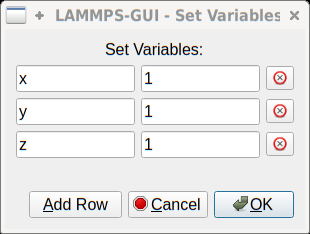

*****
Menus
*****

The menu bar has entries *File*, *Edit*, *Run*, *View*, and
*About*.  Instead of using the mouse to click on them, the individual
menus can also be activated by hitting the `Alt` key together with the
corresponding underlined letter, that is `Alt-F` activates the
*File* menu.  For the corresponding activated sub-menus, the key
corresponding the underlined letters can be used to select entries
instead of using the mouse.

File
^^^^

.. admonition:: The *File* menu offers the usual options:

   - *New* clears the current buffer and resets the file name to ``*unknown*``
   - *Open* opens a dialog to select a new file for editing in the *Editor*
   - *View* opens a dialog to select a file for viewing in a *separate* window (read-only) with support for on-the-fly decompression as explained above.
   - *Inspect restart* opens a dialog to select a file.  If that file is a
     `LAMMPS restart <https://docs.lammps.org/write_restart.html>`_ three
     windows with :ref:`information about the file are opened
     <inspect_restart>`.
   - *Save* saves the current file; if the file name is ``*unknown*``
     a dialog will open to select a new file name
   - *Save As* opens a dialog to select and new file name (and folder, if
     desired) and saves the buffer to it.  Writing the buffer to a
     different folder will also switch the current working directory to
     that folder.
   - *Quit* exits LAMMPS-GUI. If there are unsaved changes, a dialog will
     appear to either cancel the operation, or to save, or to not save the
     modified buffer.

In addition, up to 5 recent file names will be listed after the *Open*
entry that allows re-opening recently opened files.  This list is stored
when quitting and recovered when starting again.

Edit
^^^^

The *Edit* menu offers the usual editor functions like *Undo*, *Redo*,
*Cut*, *Copy*, *Paste*, and a *Find and Replace* dialog (keyboard
shortcut `Ctrl-F`).  It can also open a *Preferences* dialog (keyboard
shortcut `Ctrl-P`) and allows deleting all stored preferences and
settings, so they are reset to their default values.

Run
^^^

The *Run* menu has options to start and stop a LAMMPS process.  Rather
than calling the LAMMPS executable as a separate executable, the
LAMMPS-GUI is linked to the LAMMPS library and thus can run LAMMPS
internally through the `LAMMPS C-library interface
<https://docs.lammps.org/Library.html#lammps-c-library-api>`_ in a
separate thread.

Specifically, a LAMMPS instance will be created by calling
`lammps_open_no_mpi
<https://docs.lammps.org/Library_create.html#_CPPv418lammps_open_no_mpiiPPcPPv>`_.
The buffer contents are then executed by calling `lammps_commands_string
<https://docs.lammps.org/Library_execute.html#_CPPv422lammps_commands_stringPvPKc>`_.
Certain commands and features are only available after a LAMMPS instance
is created.  Its presence is indicated by a small LAMMPS ``L`` logo in
the status bar at the bottom left of the main window.  As an
alternative, it is also possible to run LAMMPS using the contents of the
edited file by reading the file.  This is mainly provided as a fallback
option in case the input uses some feature that is not available when
running from a string buffer.

The LAMMPS calculations are run in a concurrent thread so that the GUI
can stay responsive and be updated during the run.  The GUI can retrieve
data from the running LAMMPS instance and tell it to stop at the next
timestep.  The *Stop LAMMPS* entry will do this by calling the
`lammps_force_timeout
<https://docs.lammps.org/Library_utility.html#_CPPv420lammps_force_timeoutPv>`_
library function, which is equivalent to a `timer timeout 0
<https://docs.lammps.org/timer.html>`_ command.

The *Relaunch LAMMPS Instance* will destroy the current LAMMPS thread
and free its data and then create a new thread with a new LAMMPS
instance.  This is usually not needed, since LAMMPS-GUI tries to detect
when this is needed and does it automatically.  This is available
in case it missed something and LAMMPS behaves in unexpected ways.

The *Set Variables...* entry opens a dialog box where
`index style variables <https://docs.lammps.org/variable.html>`_ can be set. Those variables
are passed to the LAMMPS instance when it is created and are thus
set *before* a run is started.

The *Set Variables* dialog will be pre-populated with entries that
are set as index variables in the input and any variables that are
used but not defined, if the built-in parser can detect them.  New
rows for additional variables can be added through the *Add Row*
button and existing rows can be deleted by clicking on the *X* icons
on the right.

The *Create Image* entry will send a `dump image
<https://docs.lammps.org/dump_image.html>`_ command to the LAMMPS
instance, read the resulting file, and show it in an *Image Viewer*
window.

The *View in OVITO* entry will launch `OVITO <https://ovito.org>`_ with
a `data file <https://docs.lammps.org/write_data.html>`_ containing the
current state of the system.  This option is only available if
LAMMPS-GUI can find the OVITO executable in the system path.

The *View in VMD* entry will launch VMD with a `data file
<https://docs.lammps.org/write_data.html>`_ containing the current state
of the system.  This option is only available if LAMMPS-GUI can find the
VMD executable in the system path.

View
^^^^

The *View* menu offers to show or hide additional windows with log
output, charts, slide show, variables, or snapshot images.  The
default settings for their visibility can be changed in the
*Preferences* dialog.

Tutorials
^^^^^^^^^

The *Tutorials* menu is to support the set of LAMMPS tutorials for
beginners and intermediate LAMMPS users documented in (:ref:`Gravelle1
<Gravelle1>`).  From the drop down menu you can select which of the
eight currently available tutorial sessions you want to begin.  This
opens a 'wizard' dialog where you can choose in which folder you want to
work, whether you want that folder to be wiped from *any* files, whether
you want to download the solutions files (which can be large) to a
``solution`` sub-folder, and whether you want the corresponding
tutorial's online version opened in your web browser.  The dialog will
then start downloading the files requested (download progress is
reported in the status line) and load the first input file for the
selected session into LAMMPS-GUI.

About
^^^^^

The *About* menu finally offers a couple of dialog windows and an
option to launch the LAMMPS online documentation in a web browser.  The
*About LAMMPS-GUI* entry displays a dialog with a summary of the
configuration settings of the LAMMPS library in use and the version
number of LAMMPS-GUI itself.  The *Quick Help* displays a dialog with
a minimal description of LAMMPS-GUI.  The *LAMMPS-GUI Documentation* entry
will open the LAMMPS-GUI online documentation website
https://lammps-gui.lammps.org in a web browser window.
The *LAMMPS Manual* entry will open the main page of
the LAMMPS online documentation in a web browser window.
The *LAMMPS Tutorial* entry will open the main page of the set of
LAMMPS tutorials authored and maintained by Simon Gravelle at
https://lammpstutorials.github.io/ in a web browser window.

-------------

.. _Gravelle1:

**(Gravelle1)** Gravelle, Alvares, Gissinger, Kohlmeyer, `arXiv:2503.14020 \[physics.comp-ph\] <https://doi.org/10.48550/arXiv.2503.14020>`_ (2025)
