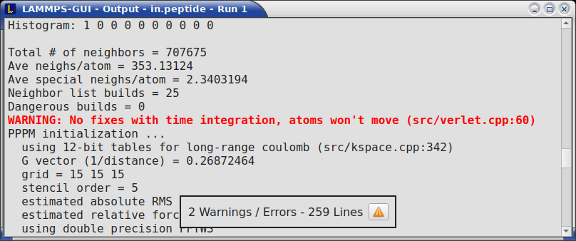
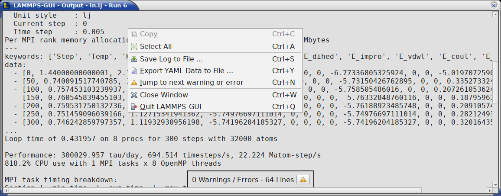
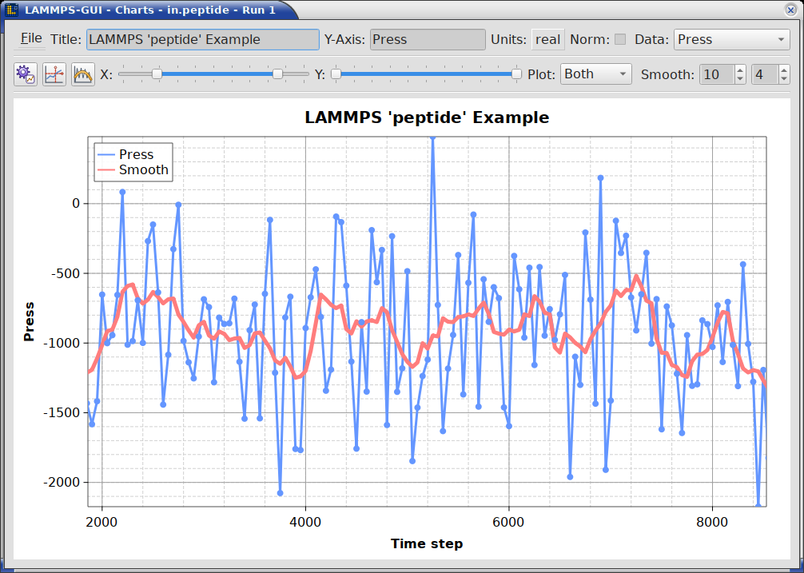
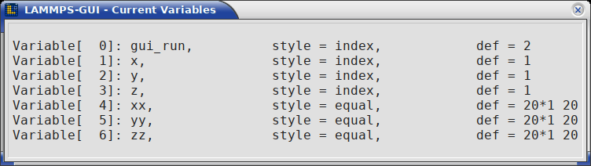

************************
Monitoring LAMMPS output
************************

.. _logfile:

Output Window
^^^^^^^^^^^^^

.. index:: output window
.. index:: log window
.. index:: screen output

By default, when starting a run, an *Output* window opens that displays
the screen output of the running LAMMPS calculation, as shown below.
This text would normally be seen in the command-line window.

LAMMPS-GUI captures the screen output from LAMMPS as it is generated and
updates the *Output* window regularly during a run.  If there are any
warnings or errors in the LAMMPS output, they are highlighted by using
bold text colored in red.  There is a small panel at the bottom center
of the *Output* window showing how many warnings and errors were
detected and how many lines the entire output has.  By clicking on the
button on the right with the warning symbol or by using the keyboard
shortcut `Ctrl-N` (`Command-N` on macOS), you can jump to the next
line with a warning or error.  If there is a URL pointing to additional
explanations in the online manual, that URL will be highlighted and
double-clicking on it shall open the corresponding manual page in
the web browser.  The option is also available from the context menu.

By default, the *Output* window is replaced each time a run is started.
The runs are counted and the run number for the current run is displayed
in the window title.  It is possible to change the behavior of
LAMMPS-GUI in the preferences dialog to create a *new* *Output* window
for every run or to not show the current *Output* window.  It is also
possible to show or hide the *current* *Output* window from the *View*
menu.

The text in the *Output* window is read-only and cannot be modified, but
keyboard shortcuts to select and copy all or parts of the text can be
used to transfer text to another program. Also, the keyboard shortcut
`Ctrl-S` (`Command-S` on macOS) is available to save the *Output* buffer to a
file.  The "Select All" and "Copy" functions, as well as a "Save Log to
File" option are also available from a context menu by clicking with the
right mouse button into the *Output* window text area.

Should the *Output* window contain embedded YAML format text (see above
for a demonstration), for example from using `thermo_style yaml
<https://docs.lammps.org/thermo_style.html>`_ or `thermo_modify line
yaml <https://docs.lammps.org/thermo_modify.html>`_, the keyboard
shortcut `Ctrl-Y` (`Command-Y` on macOS) is available to save only the
YAML parts to a file.  This option is also available from a context menu
by clicking with the right mouse button into the *Output* window text
area.

.. _charts:

Charts Window
^^^^^^^^^^^^^

.. index:: charts window
.. index:: plotting
.. index:: thermodynamic output
.. index:: data visualization

By default, when starting a run, a *Charts* window opens that displays a
plot of thermodynamic output of the LAMMPS calculation as shown below.

.. index:: smoothing
.. index:: Savitzky-Golay filter

The "Data:" drop-down menu on the top right allows selection of
different properties that are computed and written as thermodynamic
output to the output window.  Only one property can be shown at a time.
The plots are updated regularly with new data as the run progresses, so
they can be used to visually monitor the evolution of available
properties.  The update interval can be set in the *Preferences* dialog.
By default, the raw data for the selected property is plotted as a blue
graph.  From the "Plot:" drop-down menu on the second row (immediately to the right of
the *Chart Style...* and *Postprocess...* quick-access buttons),
you can select whether to plot only raw data graph, only a smoothed data
graph, or both graphs on top of each other.  The smoothing process uses
a `Savitzky-Golay convolution filter
<https://en.wikipedia.org/wiki/Savitzky%E2%80%93Golay_filter>`_.  The
convolution window width (left) and order (right) parameters can be set
in the boxes next to the drop-down menu.  Default settings are 10 and 4
which means that the smoothing window includes 10 points each to the
left and the right of the current data point for a total of 21 points
and a fourth order polynomial is fitted to the data in the window.

The "Title:" and "Y:" input boxes let you edit the text shown as the
plot title and the y-axis label, respectively.  The text entered in the
"Title:" box is applied to *all* charts, while the "Y:" text changes
only the y-axis label of the currently *selected* plot.  In standalone
plot mode (when plotting an external data file), an additional "X-Axis:"
input box is shown to the right of "Y:" and sets the x-axis label for all
charts.

The window title shows the current run number that this chart window
corresponds to.  Same as for the *Output* window, the chart window is
replaced on each new run, but the behavior can be changed in the
*Preferences* dialog.

.. index:: CSV export
.. index:: YAML export
.. index:: data export

From the *File* menu on the top left, it is possible to save an image
of the currently displayed plot or export the data in either plain text
columns (for use by plotting tools like `gnuplot
<http://www.gnuplot.info/>`_ or `grace
<https://plasma-gate.weizmann.ac.il/Grace/>`_), as CSV data which can be
imported for further processing with Microsoft Excel, `LibreOffice Calc
<https://www.libreoffice.org/>`_, or with Python via `pandas
<https://pandas.pydata.org/>`_, or as YAML which can be imported into
Python with `PyYAML <https://pyyaml.org/>`_ or pandas.

Thermo output data from successive run commands in the input script is
combined into a single data set unless the format, number, or names of
output columns are changed with a `thermo_style
<https://docs.lammps.org/thermo_style.html>`_ or a `thermo_modify
<https://docs.lammps.org/thermo_modify.html>`_ command, or the current
time step is reset with `reset_timestep
<https://docs.lammps.org/reset_timestep.html>`_, or if a `clear
<https://docs.lammps.org/clear.html>`_ command is issued.  This is where
the YAML export from the *Charts* window differs from that of the
*Output* window: here you get the compounded data set starting with the
last change of output fields or timestep setting, while the export from
the log will contain *all* YAML output but *segmented* into individual
runs.

.. index:: chart style
.. index:: legend

**Adjusting the chart style.** The *Chart Style...* entry in the chart
window's *File* menu, or the chart-style quick-access button at the far
left of the second toolbar row, opens a dialog to change how the data is
drawn.  The *Raw data* and *Processed data* series each have independent
settings for the display style (*Lines*, *Points*, or *Lines and Points*),
the color, the line width, and the point size.  This makes it possible, for
example, to show the raw data as faint points and the smoothed curve as a
bold line.
The *Legend* placement selector in the same dialog adds an in-plot legend
that lists the visible named series; it can be turned *Off* or anchored to
any of the four plot corners (*Top left*, *Top right*, *Bottom right*, or
*Bottom left*).  The selected placement is remembered across sessions.

.. versionadded:: 2.1

   The *Chart Style* dialog and the independent styling of the raw and
   processed series were added, including the per-series point size and the
   optional in-plot legend.

.. index:: reference lines

**Reference lines.** The *Reference Lines...* entry in the chart window's
*File* menu opens a dialog for adding straight annotation lines that are
drawn on *every* chart in the window.  Each line is either *Vertical* (at a
chosen x value) or *Horizontal* (at a chosen y value) and can carry a text
label and an individually chosen color.  The label position along the line
(*Top*, *Center*, or *Bottom* for vertical lines; *Left*, *Center*, or
*Right* for horizontal lines) is selected per line, while the label font
size, the gap between the label and the line, and whether the labels are
drawn in an opaque box apply to the whole window.  Reference lines are
useful, for example, to mark a target temperature, a transition point, or a
fitted value.

.. versionadded:: 2.1

   The *Reference Lines* dialog was added.

.. index:: post-processing
.. index:: curve fitting
.. index:: autocorrelation
.. index:: polynomial fit
.. index:: Birch-Murnaghan EOS
.. index:: equation of state
.. index:: custom function
.. index:: custom fit

**Post-processing the data.** The *Postprocess...* entry in the chart
window's *File* menu, or the quick-access button immediately to the right
of the *Chart Style...* button, runs an analysis on the data of the
currently selected property.  The following analyses are available:

- *Autocorrelation* computes the normalized autocorrelation function of
  the selected data up to a chosen maximum lag and shows it in a new
  chart window (the abscissa becomes the lag).  This is useful, for
  example, for estimating correlation times of fluctuating quantities.
- *Polynomial fit* performs a least-squares fit of a polynomial of a
  chosen degree, overlays the fitted curve on the chart, and reports the
  coefficients and the root-mean-square residual.
- *Birch-Murnaghan EOS fit* fits a 4-parameter `Birch-Murnaghan equation
  of state
  <https://en.wikipedia.org/wiki/Birch%E2%80%93Murnaghan_equation_of_state>`_
  to energy-versus-volume data (x = volume per unit cell, y = energy).  A
  confirmation dialog lets you verify the x and y column assignments and
  enter the number of atoms in the conventional unit cell N (default 1;
  e.g. 4 for FCC, 2 for BCC or HCP; use N = 1 when the x data is already
  the conventional cell volume rather than volume per atom).  The fit reports the equilibrium
  volume V\ :sub:`0`, the derived lattice constant
  a\ :sub:`0` = (N V\ :sub:`0`)\ :sup:`1/3`, the equilibrium energy
  E\ :sub:`0`, the bulk modulus B\ :sub:`0`, and its pressure
  derivative B\ :sub:`0`'.
- *Custom function* evaluates a user-supplied mathematical expression
  ``f(x)`` over the x range of the data and overlays it as a curve.  The
  expression uses the variable ``x`` for the abscissa and supports the
  usual arithmetic operators and functions (for example
  ``2*x^2 + 3*sin(x)``).
- *Custom fit* performs a nonlinear least-squares fit of a user-supplied
  expression to the data.  In addition to the expression, you provide the
  fit parameters and their initial guesses as ``name=value`` pairs (for
  example ``a=1, b=0.5``) and, optionally, a label for the fitted curve.
  The fit uses a Levenberg-Marquardt algorithm with analytic derivatives
  of the expression; on success the fitted curve is overlaid and the
  fitted parameters, the root-mean-square residual, and the number of
  iterations are reported.

The expressions for *Custom function* and *Custom fit* are parsed and
evaluated with a bundled subset of the Lepton expression parser, the same
library used by the LAMMPS `Lepton-based styles
<https://docs.lammps.org/pair_lepton.html>`_, so the supported syntax
matches.

When any fit or custom-function overlay is active, the "Plot:" drop-down
treats the overlay as the "smoothed" series: selecting "Smoothed" or
"Both" shows the overlay curve, while selecting "Raw" hides it.  This
applies uniformly to all analysis types (polynomial, EOS, custom function,
and custom fit).

.. versionadded:: 2.1

   The *Postprocess* dialog with the autocorrelation, polynomial,
   Birch-Murnaghan EOS, custom-function, and custom-fit analyses was
   added.

.. index:: plotting external data
.. index:: plot data file

The same *Charts* window is also used to plot data from an external file
opened with *File* -> *Plot Data File...* (`Ctrl-Shift-P`, see
:ref:`the File menu <files>`); in that standalone mode there is no
associated simulation, so the *Units* and *Norm* controls are hidden.
The column-picker dialog shown before the chart opens lets you select
which column provides the x axis and which columns to plot, and also
allows renaming columns.  An "X-Axis:" label field in the first toolbar
row (to the right of "Title:" and "Y:") lets you edit the x-axis label
after the chart opens.  All the styling, export, and post-processing
features described above work the same way.  The same column-picker and
standalone chart window are also launched when LAMMPS-GUI is invoked from
the command line with the ``-c``/``--chart`` flag (see
:ref:`command-line options <command-line-options>`).

..
   Maintainer note (screenshots): add screenshots of the *Chart Style*
   dialog, the *Postprocess* dialog, and an example chart with a fitted
   overlay curve.  Deferred until the pending dialog/layout redesign,
   which is expected to change these dialogs.

The *Preferences* dialog has a *Charts* tab, where you can configure
multiple chart-related settings, like the default title, colors for the
graphs, default choice of the raw / smooth graph selection, whether the
grid for the major and minor ticks is drawn, and the default chart graph
size.

.. admonition:: Slowdown of Simulations from Charts Data Processing
   :class: warning

   Using frequent thermo output during long simulations can result in a
   significant slowdown of that simulation since it is accumulating many
   data points for each of the thermo properties in the chart window to
   be redrawn with every update.  The updates are consuming additional
   CPU time when smoothing enabled.  This slowdown can be confirmed when
   an increasing percentage of the total run time is spent in the
   "Output" or "Other" sections of the `MPI task timing breakdown
   <https://docs.lammps.org/Run_output.html>`_.  It is thus recommended
   to use a large enough value as argument `N` for the `thermo command
   <https://docs.lammps.org/thermo.html>`_ and to select plotting only
   the "Raw" data in the *Charts* window during such simulations.  It is
   always possible to switch between the different display styles for
   charts during the simulation and after it has finished.

   .. versionchanged:: 1.7

      As of LAMMPS-GUI version 1.7 the chart data processing is
      significantly optimized compared to older versions of LAMMPS-GUI.
      The general problem of accumulating excessive amounts of data
      and the overhead of too frequently polling LAMMPS for new data
      cannot be optimized away, though.  If necessary, the command
      line LAMMPS executable needs to be used and the output accumulated
      on a very fast disk (e.g. a high-performance SSD).

Variable Info
^^^^^^^^^^^^^

.. index:: variable info window
.. index:: variables
.. index:: input script variables

During a run, it may be of interest to monitor the value of input script
variables, for example to monitor the progress of loops.  This can be
done by enabling the "Variables Window" in the *View* menu or by using
the `Ctrl-Shift-W` keyboard shortcut.  This shows info similar to the
`info variables <https://docs.lammps.org/info.html>`_ command in a
separate window as shown below.

Like for the *Output* and *Charts* windows, its content is continuously
updated during a run.  It will show "(none)" if there are no variables
defined.  Note that it is also possible to *set* `index style variables
<https://docs.lammps.org/variable.html>`_, that would normally be set
via command-line flags, via the "Set Variables..." dialog from the *Run*
menu.  LAMMPS-GUI automatically defines the variable "gui_run" to the
current value of the run counter.  That way it is possible to
automatically record a separate log for each run attempt by using the
command

.. code-block:: LAMMPS

   log logfile-${gui_run}.txt

at the beginning of an input file. That would record logs to files
``logfile-1.txt``, ``logfile-2.txt``, and so on for successive runs.
