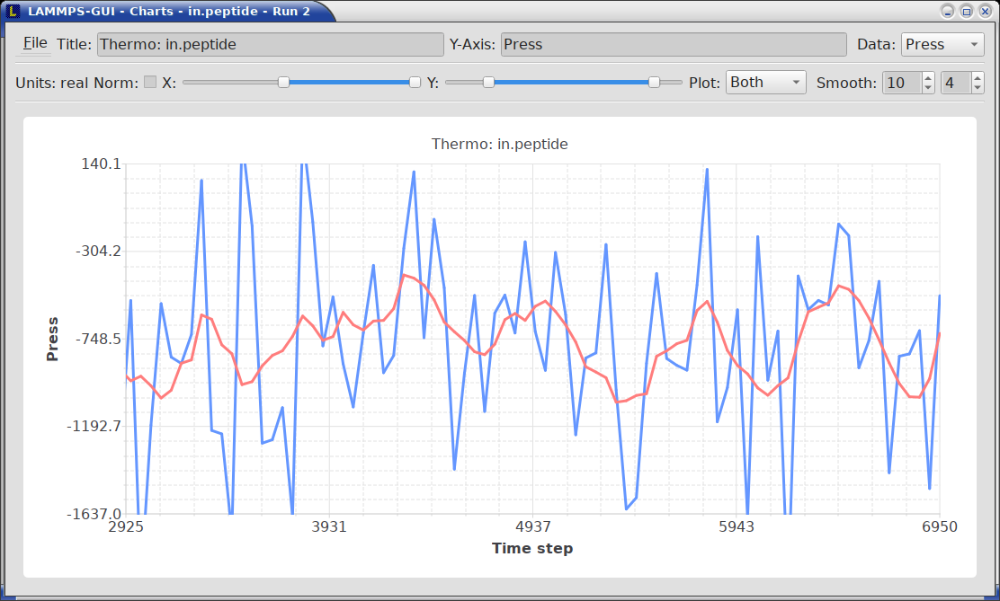

************************
Monitoring LAMMPS output
************************

Output Window
^^^^^^^^^^^^^

By default, when starting a run, an *Output* window opens that displays
the screen output of the running LAMMPS calculation, as shown below.
This text would normally be seen in the command-line window.

LAMMPS-GUI captures the screen output from LAMMPS as it is generated and
updates the *Output* window regularly during a run.  If there are any
warnings or errors in the LAMMPS output, they are highlighted by using
bold text colored in red.  There is a small panel at the bottom center
of the *Output* window showing how many warnings and errors were
detected and how many lines the entire output has.  By clicking on the
button on the right with the warning symbol or by using the keyboard
shortcut `Ctrl-N` (`Command-N` on macOS), you can jump to the next
line with a warning or error.  If there is a URL pointing to additional
explanations in the online manual, that URL will be highlighted and
double-clicking on it shall open the corresponding manual page in
the web browser.  The option is also available from the context menu.

By default, the *Output* window is replaced each time a run is started.
The runs are counted and the run number for the current run is displayed
in the window title.  It is possible to change the behavior of
LAMMPS-GUI in the preferences dialog to create a *new* *Output* window
for every run or to not show the current *Output* window.  It is also
possible to show or hide the *current* *Output* window from the *View*
menu.

The text in the *Output* window is read-only and cannot be modified, but
keyboard shortcuts to select and copy all or parts of the text can be
used to transfer text to another program. Also, the keyboard shortcut
`Ctrl-S` (`Command-S` on macOS) is available to save the *Output* buffer to a
file.  The "Select All" and "Copy" functions, as well as a "Save Log to
File" option are also available from a context menu by clicking with the
right mouse button into the *Output* window text area.

Should the *Output* window contain embedded YAML format text (see above
for a demonstration), for example from using `thermo_style yaml
<https://docs.lammps.org/thermo_style.html>`_ or `thermo_modify line
yaml <https://docs.lammps.org/thermo_modify.html>`_, the keyboard
shortcut `Ctrl-Y` (`Command-Y` on macOS) is available to save only the
YAML parts to a file.  This option is also available from a context menu
by clicking with the right mouse button into the *Output* window text
area.

Charts Window
^^^^^^^^^^^^^

By default, when starting a run, a *Charts* window opens that displays a
plot of thermodynamic output of the LAMMPS calculation as shown below.

The "Data:" drop down menu on the top right allows selection of
different properties that are computed and written as thermodynamic
output to the output window.  Only one property can be shown at a time.
The plots are updated regularly with new data as the run progresses, so
they can be used to visually monitor the evolution of available
properties.  The update interval can be set in the *Preferences* dialog.
By default, the raw data for the selected property is plotted as a blue
graph.  From the "Plot:" drop menu on the second row and on the left,
you can select whether to plot only raw data graph, only a smoothed data
graph, or both graphs on top of each other.  The smoothing process uses
a `Savitzky-Golay convolution filter
<https://en.wikipedia.org/wiki/Savitzky%E2%80%93Golay_filter>`_.  The
convolution window width (left) and order (right) parameters can be set
in the boxes next to the drop down menu.  Default settings are 10 and 4
which means that the smoothing window includes 10 points each to the
left and the right of the current data point for a total of 21 points
and a fourth order polynomial is fitted to the data in the window.

The "Title:" and "Y:" input boxes allow to edit the text shown as the
plot title and the y-axis label, respectively.  The text entered in the
"Title:" box is applied to *all* charts, while the "Y:" text changes
only the y-axis label of the currently *selected* plot.

The window title shows the current run number that this chart window
corresponds to.  Same as for the *Output* window, the chart window is
replaced on each new run, but the behavior can be changed in the
*Preferences* dialog.

From the *File* menu on the top left, it is possible to save an image
of the currently displayed plot or export the data in either plain text
columns (for use by plotting tools like `gnuplot
<http://www.gnuplot.info/>`_ or `grace
<https://plasma-gate.weizmann.ac.il/Grace/>`_), as CSV data which can be
imported for further processing with Microsoft Excel `LibreOffice Calc
<https://www.libreoffice.org/>`_ or with Python via `pandas
<https://pandas.pydata.org/>`_, or as YAML which can be imported into
Python with `PyYAML <https://pyyaml.org/>`_ or pandas.

Thermo output data from successive run commands in the input script is
combined into a single data set unless the format, number, or names of
output columns are changed with a `thermo_style
<https://docs.lammps.org/thermo_style.html>`_ or a `thermo_modify
<https://docs.lammps.org/thermo_modify.html>`_ command, or the current
time step is reset with `reset_timestep
<https://docs.lammps.org/reset_timestep.html>`_, or if a `clear
<https://docs.lammps.org/clear.html>`_ command is issued.  This is where
the YAML export from the *Charts* window differs from that of the
*Output* window: here you get the compounded data set starting with the
last change of output fields or timestep setting, while the export from
the log will contain *all* YAML output but *segmented* into individual
runs.

The *Preferences* dialog has a *Charts* tab, where you can configure
multiple chart-related settings, like the default title, colors for the
graphs, default choice of the raw / smooth graph selection, and the
default chart graph size.

.. admonition:: Slowdown of Simulations from Charts Data Processing
   :class: warning

   Using frequent thermo output during long simulations can result in a
   significant slowdown of that simulation since it is accumulating many
   data points for each of the thermo properties in the chart window to
   be redrawn with every update.  The updates are consuming additional
   CPU time when smoothing enabled.  This slowdown can be confirmed when
   an increasing percentage of the total run time is spent in the
   "Output" or "Other" sections of the `MPI task timing breakdown
   <https://docs.lammps.org/Run_output.html>`_.  It is thus recommended
   to use a large enough value as argument `N` for the `thermo command
   <https://docs.lammps.org/thermo.html>`_ and to select plotting only
   the "Raw" data in the *Charts Window* during such simulations.  It is
   always possible to switch between the different display styles for
   charts during the simulation and after it has finished.

   .. versionchanged:: 1.7

      As of LAMMPS-GUI version 1.7 the chart data processing is
      significantly optimized compared to older versions of LAMMPS-GUI.
      The general problem of accumulating excessive amounts of data
      and the overhead of too frequently polling LAMMPS for new data
      cannot be optimized away, though.  If necessary, the command
      line LAMMPS executable needs to be used and the output accumulated
      of a very fast disk (e.g. a high-performance SSD).

Variable Info
^^^^^^^^^^^^^

During a run, it may be of interest to monitor the value of input script
variables, for example to monitor the progress of loops.  This can be
done by enabling the "Variables Window" in the *View* menu or by using
the `Ctrl-Shift-W` keyboard shortcut.  This shows info similar to the
`info variables <https://docs.lammps.org/info.html>`_ command in a
separate window as shown below.

Like for the *Output* and *Charts* windows, its content is continuously
updated during a run.  It will show "(none)" if there are no variables
defined.  Note that it is also possible to *set* `index style variables
<https://docs.lammps.org/variable.html>`_, that would normally be set
via command-line flags, via the "Set Variables..." dialog from the *Run*
menu.  LAMMPS-GUI automatically defines the variable "gui_run" to the
current value of the run counter.  That way it is possible to
automatically record a separate log for each run attempt by using the
command

.. code-block:: LAMMPS

   log logfile-${gui_run}.txt

at the beginning of an input file. That would record logs to files
``logfile-1.txt``, ``logfile-2.txt``, and so on for successive runs.
