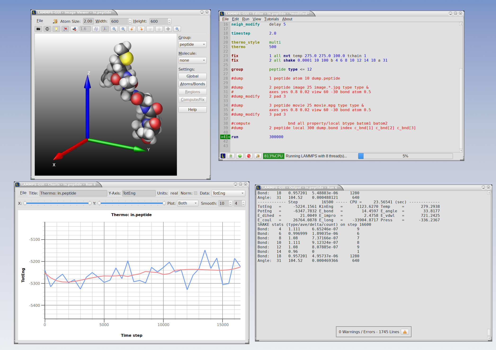

********
Overview
********

LAMMPS-GUI is a graphical text editor customized for editing LAMMPS
input files that are linked to the `LAMMPS C-library
<https://docs.lammps.org/Library.html#lammps-c-library-api>`_ and thus
can run LAMMPS directly using the contents of the editor's text buffer
as input.  It can retrieve and display information from LAMMPS while it
is running, display visualizations created with the `dump image command
<https://docs.lammps.org/dump_image.html>`_, and is adapted specifically
for editing LAMMPS input files through syntax highlighting, text
completion, and reformatting, and linking to the online LAMMPS
documentation for known LAMMPS commands and styles.

LAMMPS-GUI aims to support a workflow similar to the traditional
experience of running LAMMPS using a text editor, a command-line window,
launching the LAMMPS text-mode executable printing output to the screen,
and post-processing and visualizing LAMMPS' output but just integrated
into a single application.

LAMMPS-GUI integrates well with graphical desktop environments where the
`.lmp` filename extension can be registered with LAMMPS-GUI as the
executable to launch when double clicking on such files using a file
manager.  LAMMPS-GUI will launch and read the file into its buffer.
Input files can also be dropped into the editor window of the running
LAMMPS-GUI application, which will close the current file and open the
new file.

LAMMPS-GUI makes it easier for beginners to get started running LAMMPS
and is well-suited for LAMMPS tutorials, since you only need to work
with a single, ready-to-use program for most of the tasks.  Plus it is
available for download as pre-compiled package for popular operating
systems (Linux, macOS, Windows).  This saves time and allows users to
focus on learning LAMMPS itself, without the need to learn how to
compile LAMMPS, learn how to use the command line, or learn how to use a
separate text editor, plotting or visualization program.

The tutorials at https://lammpstutorials.github.io/ are specifically
updated for use with LAMMPS-GUI and their tutorial materials can be
downloaded and edited directly from within the GUI while automatically
loading the matching tutorial instructions into a web browser.

While making it easy for beginners to start with LAMMPS, it is also the
expectation that LAMMPS-GUI users will eventually transition to
workflows that most experienced LAMMPS users employ.  That traditional
procedure is effective for people proficient in using the command-line,
as it allows them to use the tools for the individual steps that they
are most comfortable with.  In fact, it is often *required* to adopt
this workflow when running LAMMPS simulations on high-performance
computing facilities.

Most features in LAMMPS-GUI have been exposed to keyboard shortcuts, so
that there is also appeal for experienced LAMMPS users for prototyping
and testing simulation setups.

.. admonition:: Features

   A detailed discussion and explanation of all features and functionality
   are in the following pages. Here are a few highlights of LAMMPS-GUI:

   - Text editor with line numbers and syntax highlighting customized for LAMMPS
   - Text editor features command completion and indentation for known commands and styles
   - Text editor will switch its working directory to folder of file in buffer
   - Indicator for currently executed command
   - Indicator for line that caused an error
   - Progress bar indicates how far a run command is completed and how CPUs are utilized
   - Context-sensitive help for LAMMPS commands via the online documentation
   - Auto-adapting to features and packages available in the LAMMPS library in use
   - LAMMPS is running in a concurrent thread, so the GUI remains responsive
   - LAMMPS can be started and stopped with a mouse click or a hotkey
   - Screen output is captured in an *Output* Window
   - Many adjustable settings and preferences that are persistent including the 5 most recent files
   - Thermodynamic output is captured and displayed as line graph in a *Chart* Window
   - Interactive visualization of current state via calling `write_dump
     image <https://docs.lammps.org/dump_image.html>`_
   - Capture of images created by `dump image
     <https://docs.lammps.org/dump_image.html>`_ in Slide show window
   - Dialog to set variables, similar to the LAMMPS command-line flag '-v' / '-var'
   - Support for GPU, INTEL, KOKKOS/OpenMP, OPENMP, and OPT accelerator packages
   - Inspection of binary restart files created by LAMMPS
   - Integration with `LAMMPS tutorials <https://lammpstutorials.github.io>`_
