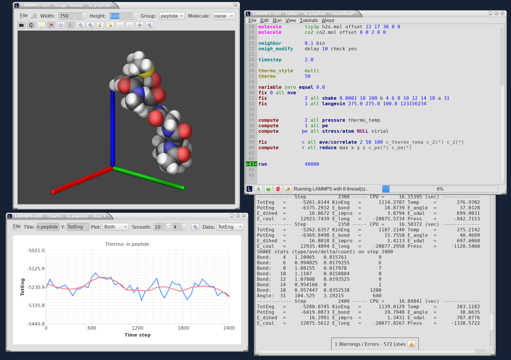

********
Overview
********

LAMMPS-GUI is a graphical text editor customized for editing LAMMPS
input files that is linked to the :ref:`LAMMPS C-library <lammps_c_api>`
and thus can run LAMMPS directly using the contents of the editor's text
buffer as input.  It can retrieve and display information from LAMMPS
while it is running, display visualizations created with the :doc:`dump
image command <dump_image>`, and is adapted specifically for editing
LAMMPS input files through syntax highlighting, text completion, and
reformatting, and linking to the online LAMMPS documentation for known
LAMMPS commands and styles.

This is similar to what people traditionally would do to run LAMMPS but
all rolled into a single application: that is, using a text editor,
plotting program, and a visualization program to edit the input, run
LAMMPS, process the output into graphs and visualizations from a command
line window.  This similarity is a design goal. While making it easy for
beginners to start with LAMMPS, it is also the expectation that
LAMMPS-GUI users will eventually transition to workflows that most
experienced LAMMPS users employ.

Features have been extensively exposed to keyboard shortcuts, so that
there is also appeal for experienced LAMMPS users for prototyping and
testing simulation setups.

Features
^^^^^^^^

A detailed discussion and explanation of all features and functionality
are in the :doc:`Howto_lammps_gui` tutorial Howto page.

Here are a few highlights of LAMMPS-GUI

- Text editor with line numbers and syntax highlighting customized for LAMMPS
- Text editor features command completion and auto-indentation for known commands and styles
- Text editor will switch its working directory to folder of file in buffer
- Many adjustable settings and preferences that are persistent including the 5 most recent files
- Context specific LAMMPS command help via online documentation
- LAMMPS is running in a concurrent thread, so the GUI remains responsive
- Progress bar indicates how far a run command is completed
- LAMMPS can be started and stopped with a mouse click or a hotkey
- Screen output is captured in an *Output* Window
- Thermodynamic output is captured and displayed as line graph in a *Chart* Window
- Indicator for currently executed command
- Indicator for line that caused an error
- Visualization of current state in Image Viewer (via calling :doc:`write_dump image <dump_image>`)
- Capture of images created via :doc:`dump image <dump_image>` in Slide show window
- Dialog to set variables, similar to the LAMMPS command-line flag '-v' / '-var'
- Support for GPU, INTEL, KOKKOS/OpenMP, OPENMP, and OPT accelerator packages

Parallelization
^^^^^^^^^^^^^^^

Due to its nature as a graphical application, it is not possible to use
the LAMMPS-GUI in parallel with MPI, but OpenMP multi-threading and GPU
acceleration is available and enabled by default.  GPU acceleration is
currently incompatible with running LAMMPS-GUI in a flatpak sandbox.

