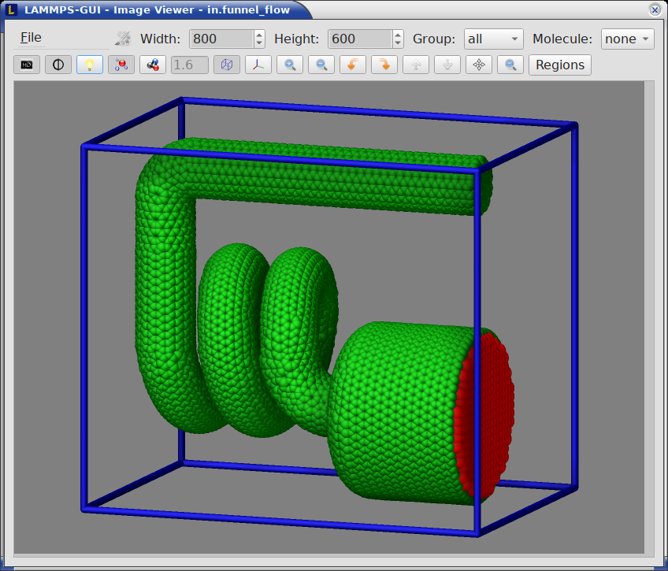
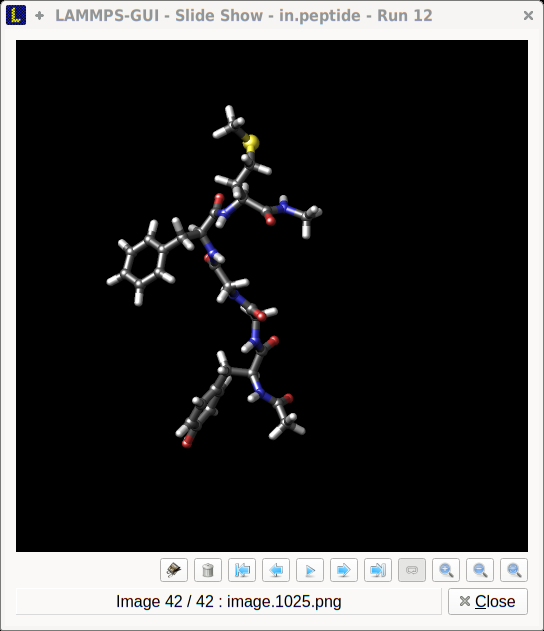

*************
Visualization
*************

.. _snapshot_viewer:

Snapshot Image Viewer
^^^^^^^^^^^^^^^^^^^^^

.. index:: snapshot viewer
.. index:: image viewer
.. index:: visualization
.. index:: dump image

By selecting the *Create Image* entry in the *Run* menu, or by hitting
the `Ctrl-I` (`Command-I` on macOS) keyboard shortcut, or by clicking on
the "palette" button in the status bar of the *Editor* window,
LAMMPS-GUI sends a custom `write_dump image
<https://docs.lammps.org/dump_image.html>`_ command to LAMMPS and reads
back the resulting snapshot image with the current state of the system
into an image viewer.  This functionality is *not* available *during* an
ongoing run.  In case LAMMPS is not yet initialized, LAMMPS-GUI tries to
identify the line with the first run or minimize command and execute all
commands from the input buffer up to that line, and then executes a "run
0" command.  This initializes the system so an image of the initial
state of the system can be rendered.  If there was an error in that
process, the snapshot image viewer does not appear.

When possible, LAMMPS-GUI tries to detect which elements the atoms
correspond to (via their mass) and then colorizes them in the image and
sets their atom diameters accordingly.  If this is not possible, for
instance when using reduced (= 'lj') `units
<https://docs.lammps.org/units.html>`_, then LAMMPS-GUI will check the
current pair style and if it is a Lennard-Jones type potential, it will
extract the *sigma* parameter for each atom type and assign atom
diameters from those numbers.  For cases where atom diameters are not
auto-detected, the *Atom size* field can be edited and a suitable value
set manually.  The default value is inferred from the x-direction
lattice spacing.  It is also possible to visualize regions and have
bonds computed dynamically for potentials, where the bonds are
determined implicitly (like `AIREBO
<https://docs.lammps.org/pair_airebo.html>`_.  Please see the
documentation of the `dump image command
<https://docs.lammps.org/dump_image.html>`_ for more details on these
two features.

If elements cannot be detected the default sequence of colors of the
`dump image <https://docs.lammps.org/dump_image.html>`_ command is
assigned to the different atom types.

.. |gui-image1| image:: JPG/lammps-gui-image.png
   :width: 22.3%

.. |gui-image4| image:: JPG/lammps-gui-autobond.png
   :width: 25%

|gui-image1|  |gui-image2|  |gui-image3|  |gui-image4|

Image Viewer controls
---------------------

.. index:: image viewer controls

The Image Viewer window consists of three main areas: a menu/toolbar
strip at the top, the rendered image in the center, and a settings
panel on the right side.

The **menu/toolbar strip** contains the *File* menu, image dimension
controls, and a row of toggle and action buttons.  The *File* menu
provides the following actions:

- **Save As...** (`Ctrl-S`): Save the rendered image to a file.  The
  file format is inferred from the file name extension.  When the
  `ImageMagick software <https://imagemagick.org/>`_ is installed,
  additional file formats beyond those natively supported by the Qt
  library become available.
- **Copy Image** (`Ctrl-C`): Copy the rendered image to the clipboard
  for pasting into another application.
- **Copy dump image command** (`Ctrl-D`): Copy the current `dump image
  <https://docs.lammps.org/dump_image.html>`_ and `dump_modify
  <https://docs.lammps.org/dump_image.html>`_ commands to the clipboard
  so they can be pasted into a LAMMPS input file.  This allows the
  current visualization settings to be reproduced during a simulation
  run, including in the :ref:`slide show viewer <slideshow>`.
- **Close** (`Ctrl-W`): Close the Image Viewer window.
- **Quit** (`Ctrl-Q`): Quit the entire application.

Next to the *File* menu, the **Width** and **Height** spin boxes set
the pixel dimensions of the rendered image.  The small palette icon
on the left is colored while LAMMPS is rendering a new image and
grayed out when rendering is complete.

The **toolbar buttons** below the menu bar provide quick access to
rendering options and view manipulation.  From left to right:

- **SSAO** (toggle): Enable or disable Screen Space Ambient Occlusion
  rendering for a more spatial, depth-shaded appearance.
- **Anti-aliasing** (toggle): Render the image at double resolution and
  scale down for smoother edges.  This produces higher quality images at
  the expense of more CPU time.
- **Shininess** (toggle): Switch between shiny and matte surface
  rendering of atoms and bonds.
- **VDW style** (toggle): Switch between space-filling (Van der Waals)
  sphere representation and the smaller ball-and-stick style.
- **Dynamic bonds** (toggle): Automatically compute bonds from atom
  distances.  This is useful for force fields with implicit bonds.  When
  enabled, the adjacent text field allows setting the bond cutoff
  distance.
- **Box** (toggle): Show or hide the simulation box drawn as colored
  sticks.
- **Axes** (toggle): Show or hide the labeled coordinate axes arrows.
- **Zoom in** / **Zoom out**: Adjust the zoom level by 10 percent per
  click.
- **Rotate left** / **Rotate right**: Rotate the view horizontally by
  15 degrees per click.
- **Rotate up** / **Rotate down**: Rotate the view vertically by
  15 degrees per click.
- **Recenter**: Recenter the view on the center of mass of the currently
  selected group.
- **Reset**: Reset the view to the default orientation and zoom level.

The default image size, some default image quality settings, the view
style and some colors can be changed in the *Preferences* dialog window.
From the image viewer window further adjustments can be made: actual
image size, high-quality (SSAO) rendering, anti-aliasing, view style,
display of box or axes, zoom factor.  The view of the system can be
rotated horizontally and vertically.

The **settings panel** on the right side of the window provides
additional controls:

- **Group**: A drop-down list to select which `group
  <https://docs.lammps.org/group.html>`_ of atoms to display (default
  is "all").  Only atoms belonging to the selected group are rendered.
- **Molecule**: A drop-down list to select a `molecule
  <https://docs.lammps.org/molecule.html>`_ to visualize (default is
  "none").  When a molecule is selected, it is shown at the center of
  the simulation box, and the group selection is disabled.  Selecting
  "none" restores normal group-based display.
- **Global**: Opens the :ref:`Global image settings <global_settings>`
  dialog for fine-grained control of axes, box, background, quality,
  and center settings.
- **Atoms/Bonds**: Opens the :ref:`Atom and bond settings <atom_settings>`
  dialog for detailed atom, bond, VDW, and rigid body visualization
  options.
- **Regions**: Opens the :ref:`Region settings <region_settings>` dialog
  to configure visualization of `regions
  <https://docs.lammps.org/region.html>`_ defined in the simulation.
- **Compute/Fix**: Opens the :ref:`Compute and fix graphics
  <fix_settings>` dialog to enable and configure extra graphics objects
  provided by compute and fix styles.
- **Help**: Opens the online documentation for the visualization
  features.

The image is re-rendered after each change, and when there are many
atoms to render and high quality images with anti-aliasing are
requested, re-rendering may take several seconds.

.. _global_settings:

Global image settings
---------------------

.. index:: image settings
.. index:: global image settings
.. index:: dump_modify

While some default settings for the image output can be configured in
the "Snapshot Image" tab of the :ref:`Preferences dialog <image_preferences>`,
more fine-grained configuration is possible by opening the "Global
image settings" dialog.  This dialog is opened by pressing the "Global"
button in the settings panel or by using the `Alt-L` keyboard mnemonic.
The settings in this dialog correspond to options of the LAMMPS
`dump image and dump_modify commands
<https://docs.lammps.org/dump_image.html>`_.

.. figure:: JPG/lammps-gui-image-settings.png

   Detailed global image settings dialog

The dialog is organized into the following sections:

**Axes**
   Controls the display of coordinate axes arrows in the image.

   - **Axes** (checkbox): Enable or disable rendering of coordinate axes.
   - **Location** (radio buttons): Select where the axes are drawn in
     the image -- *Lower Left* (default), *Lower Right*, *Upper Left*,
     *Upper Right*, or *Center*.
   - **Length**: The length of the axes arrows as a fraction of the image
     size (range: 0.000001 -- 10.0).
   - **Diameter**: The diameter of the axes arrows as a fraction of the
     image size (range: 0.000001 -- 1.0).
   - **Transparency**: The transparency of the axes (range: 0.0 -- 1.0,
     where 0.0 is fully opaque).

**Box**
   Controls the display of the simulation box.

   - **Box** (checkbox): Enable or disable rendering of the simulation
     box.
   - **Color**: The color used to draw the box edges.  Accepts
     `named colors <https://docs.lammps.org/dump_image.html>`_ or
     hex color values.
   - **Diameter**: The diameter of the box edge sticks (range: 0.000001
     -- 1.0).
   - **Transparency**: The transparency of the box edges (range: 0.0 --
     1.0).

**Subbox**
   Controls the display of the processor sub-domain box (relevant for
   parallel simulations).

   - **Subbox** (checkbox): Enable or disable rendering of the sub-domain
     box.
   - **Diameter**: The diameter of the sub-domain box edge sticks (range:
     0.000001 -- 1.0).

**Background**
   Sets the background color(s) of the rendered image.

   - **Bottomcolor**: The background color at the bottom of the image.
   - **Topcolor**: The background color at the top of the image.  If the
     two colors differ, a vertical gradient is applied from bottom to
     top.

**Quality**
   Controls rendering quality options.

   - **FSAA** (checkbox): Enable or disable full-scene anti-aliasing.
   - **SSAO** (checkbox): Enable or disable Screen Space Ambient
     Occlusion for depth-shaded rendering.
   - **SSAO strength**: The strength of the SSAO effect (range: 0.0 --
     1.0).
   - **Shiny**: The shininess factor for surface rendering (range: 0.0
     -- 1.0, where 0.0 is matte and 1.0 is fully shiny).

**Center**
   Adjusts the center point of the rendered view.

   - **X-direction**, **Y-direction**, **Z-direction**: Fractional
     coordinates (range: 0.0 -- 1.0) specifying the center of the
     view relative to the simulation box.

Press **Apply** to apply the current settings and re-render the image,
or **Cancel** to discard changes.  The **Help** button opens the LAMMPS
`dump image <https://docs.lammps.org/dump_image.html>`_ documentation.

.. note::

   Some options (axes location, axes transparency, box transparency,
   top background color) require LAMMPS version 11 Feb 2026 or later.
   These fields are disabled when an older version of LAMMPS is used.

.. _atom_settings:

Atom and bond settings
----------------------

.. index:: atom settings
.. index:: bond settings
.. index:: VDW style
.. index:: rigid bodies

This dialog offers more detailed customizations for atom and bond
visualization that are not directly accessible from the main Image
Viewer toolbar.  It is opened by pressing the "Atoms/Bonds" button in
the settings panel or by using the `Alt-A` keyboard mnemonic.

.. figure:: JPG/lammps-gui-image-atom.png

   Detailed atom and bond settings dialog

The dialog contains the following sections:

**Atoms**
   Controls how atoms are rendered.

   - **Atoms** (checkbox): Enable or disable rendering of atoms.
   - **Color**: Select the per-atom property used for coloring.
     Options include *type*, *element* (if detected), *mol*, *q*
     (charge), *diameter*, *id*, *mass*, *x*/*y*/*z* (coordinates), as
     well as atom-style variables (`v_<name>`), per-atom compute results
     (`c_<name>` or `c_<name>[col]`), and per-atom fix results
     (`f_<name>` or `f_<name>[col]`).
   - **Size**: Select the property used for atom sizing.  Options
     include *auto* (when element, diameter, or sigma data is available),
     *type*, and *element*.
   - **Transparency**: The transparency of atoms (range: 0.0 -- 1.0).

**VDW Style**
   Controls the Van der Waals space-filling representation and the
   associated colormap.

   - **VDW style** (checkbox): Enable or disable space-filling sphere
     rendering.  When unchecked, the ball-and-stick style is used.
   - **Colormap**: Select the colormap used for coloring by a continuous
     per-atom property.  Available colormaps are: *BWR* (blue-white-red),
     *RWB*, *GWR*, *BWG*, *Grayscale*, *Rainbow*, *Contrast*, *Heatmap*,
     and *Sequential*.  See the LAMMPS `dump_modify colormap documentation
     <https://docs.lammps.org/dump_image.html>`_ for details.
   - **Min** / **Max**: Set the range of the colormap.  Use *auto* to
     have LAMMPS determine the range automatically, or *min*/*max* to
     use the per-atom minimum/maximum, or specify an explicit numeric
     value.

**Bonds**
   Controls bond visualization.

   - **Bonds** (checkbox): Enable or disable bond rendering.  This
     option is only available when the atom style supports explicit
     bonds.
   - **Color**: Select bond coloring mode -- *atom* (colored by the
     atom type at each end) or *type* (uniform color per bond type).
   - **Size**: Select bond diameter mode -- *atom*, *type*, *none*, or
     a custom numeric value.
   - **AutoBonds** (checkbox): Automatically determine bonds from atom
     distances, useful for force fields with implicit bonds like
     `AIREBO <https://docs.lammps.org/pair_airebo.html>`_.
   - **Cutoff**: The distance cutoff used for automatic bond detection
     (range: 0.001 -- 10.0).  Only available when auto-bonds are
     supported.

**Bodies**
   Controls visualization of rigid bodies (when present in the
   simulation).

   - **Bodies** (checkbox): Enable or disable rendering of rigid body
     shapes.
   - **Diameter**: The diameter used for body rendering (range: 0.1 --
     10.0).
   - **Indexed** (checkbox): Use indexed coloring for bodies.
   - **Style** (radio buttons): Select the body rendering style --
     *Cylinders*, *Triangles*, or *Both*.

Press **Apply** to apply the settings and re-render the image, or
**Cancel** to discard changes.

.. _region_settings:

Region settings
---------------

.. index:: region visualization
.. index:: region settings

This dialog allows enabling and configuring the visualization of
`regions <https://docs.lammps.org/region.html>`_ defined in the LAMMPS
input script.  It is opened by pressing the "Regions" button in the
settings panel or by using the `Alt-R` keyboard mnemonic.  The dialog
only appears when at least one region is defined in the current
simulation.

For each region, the following settings can be adjusted:

- **Region ID**: The identifier of the region (read-only).
- **Show** (checkbox): Enable or disable visualization of this region.
- **Style**: The rendering style for the region surface -- *frame*
  (wireframe), *filled* (solid), *transparent* (see-through solid), or
  *points* (point cloud).
- **Color**: The color used to render the region.  Accepts `named
  colors <https://docs.lammps.org/dump_image.html>`_ or hex color
  values.
- **Size**: The diameter of the lines (for frame style) or points (for
  points style).
- **# Points**: The number of points used to approximate the region
  surface (range: 100 -- 1,000,000).  Higher values produce smoother
  surfaces at the cost of longer rendering times.
- **Opacity**: The opacity of the region rendering (range: 0.0 -- 1.0,
  where 1.0 is fully opaque).

Press **Apply** to apply the settings and re-render the image, or
**Cancel** to discard changes.  The **Help** button opens the LAMMPS
`visualization howto <https://docs.lammps.org/Howto_viz.html>`_
documentation.

.. _fix_settings:

Graphics from computes and fixes
--------------------------------

.. index:: image computes
.. index:: image fixes
.. index:: compute graphics
.. index:: fix graphics

Starting with the 11 Feb 2026 version of LAMMPS, it is possible for
compute and fix styles to prepare lists of graphics objects for
inclusion into visualizations generated by the `dump image
<https://docs.lammps.org/dump_image.html>`_ command.  This command
is used internally by LAMMPS-GUI to create the snapshot image.

The "Visualize Compute and Fix Graphics Objects" dialog allows enabling
these graphics objects and adjusting their settings.  The dialog is
opened by pressing the "Compute/Fix" button in the settings panel or by
using the `Alt-C` keyboard mnemonic.  The dialog only appears when at
least one compute or fix with graphics capabilities is defined.

.. figure:: JPG/lammps-gui-image-fix-graphics.png

   Compute and fix visualization settings dialog

For each compute or fix that supports graphics output, the following
settings can be adjusted:

- **Compute/Fix ID**: The identifier of the compute or fix (read-only).
- **Style**: The compute or fix style name (read-only).
- **Show** (checkbox): Enable or disable visualization of the graphics
  objects from this compute or fix.
- **Color Style**: Select the coloring mode -- *type*, *element*, or
  *const* (constant color).
- **Color**: The color to use when *const* color style is selected.
  Accepts `named colors <https://docs.lammps.org/dump_image.html>`_
  or hex color values.
- **Opacity**: The opacity of the graphics objects (range: 0.0 -- 1.0).
- **Flag #1** / **Flag #2**: Style-specific numeric flags that control
  additional rendering options.  Their meaning depends on the
  specific compute or fix style.

Each row also has a **Help** button that opens the LAMMPS documentation
page for the corresponding compute or fix style, jumping directly to the
"Dump image info" section that describes the available graphics objects
and flag settings.

Press **Apply** to apply the settings and re-render the image, or
**Cancel** to discard changes.  The general **Help** button at the
bottom opens the LAMMPS `dump image
<https://docs.lammps.org/dump_image.html>`_ documentation.

.. _slideshow:

Image Slide Show
^^^^^^^^^^^^^^^^

.. index:: slideshow
.. index:: animation
.. index:: image sequence
.. index:: movie export
.. index:: image export

By default, if the LAMMPS input contains a `dump image
<https://docs.lammps.org/dump_image.html>`_ command, a "Slide Show"
window opens which loads and displays the images created by LAMMPS as
they are written.  This is a convenient way to visually monitor the
progress of the simulation.

Slide show controls
-------------------

.. index:: slideshow controls

The toolbar at the bottom of the Slide Show window provides the
following controls, organized from left to right:

**Export and file operations** (left group):

- **Export to movie**: Export the entire image sequence to a movie file
  or `animated GIF file <https://en.wikipedia.org/wiki/GIF#Animated_GIF>`_.
  This requires either the `FFmpeg program <https://ffmpeg.org/>`_ or
  the `ImageMagick software <https://imagemagick.org/>`_ to be
  installed.  Supported output formats include MP4, MKV, AVI, MPG,
  MPEG, and GIF.  The file format is determined by the file name
  extension.  Any active image transformations (rotation, mirroring)
  are applied to the exported movie.
- **Export to image**: Save the currently displayed image to a file,
  including any applied transformations (rotation, mirroring).
  The file format is inferred from the file name extension.  When the
  `ImageMagick software <https://imagemagick.org/>`_ is installed,
  additional file formats beyond those natively supported by the Qt
  library become available.
- **Copy to clipboard**: Copy the current image to the system clipboard
  (keyboard shortcut `Ctrl-C`).
- **Delete all images**: Remove all image files associated with the
  slide show.  Since the number of image files can be large for long
  simulations, this provides a safe way to clean up the working
  directory without risk of accidentally deleting other files.

**Delay control** (center):

- **Delay** (spin box): Set the delay in milliseconds between frames
  during animation playback.

**Playback controls** (center group):

- **First**: Jump to the first image in the sequence.
- **Previous**: Step back to the previous image.
- **Play**: Start playing the animation from the current frame to the
  last frame.
- **Next**: Step forward to the next image.
- **Last**: Jump to the last image in the sequence.
- **Loop**: Toggle continuous looping of the animation.  When enabled,
  playback wraps around from the last image back to the first.

**Zoom controls**:

- **Zoom in**: Increase the displayed image size by 10 percent.
- **Zoom out**: Decrease the displayed image size by 10 percent.
- **Reset zoom**: Reset the display to the original image size.

**Image transformation controls** (right group):

- **Rotate clockwise**: Rotate the displayed image 90 degrees clockwise.
- **Rotate counter-clockwise**: Rotate the displayed image 90 degrees
  counter-clockwise.
- **Mirror horizontally**: Flip the displayed image along the vertical
  axis.
- **Mirror vertically**: Flip the displayed image along the horizontal
  axis.

These image transformations are useful when the simulation images need
to be adjusted for presentation purposes.  Transformations are also
applied when exporting images or movies.

A **scroll bar** below the image area allows selecting any individual
frame in the sequence by position.  If you are uncertain about the
function of a specific button, you can place the cursor on top of it and
a descriptive tooltip will appear.
