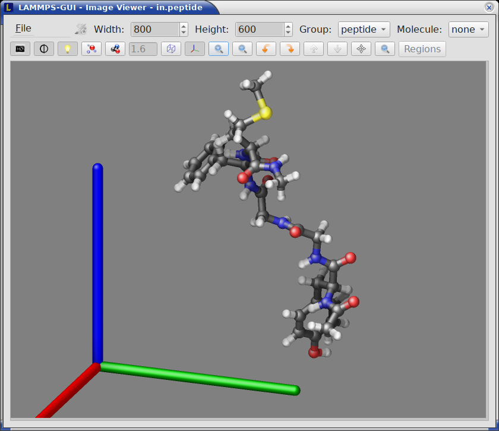

*************
Visualization
*************

.. _snapshot_viewer:

Snapshot Image Viewer
^^^^^^^^^^^^^^^^^^^^^

.. index:: snapshot viewer
.. index:: image viewer
.. index:: visualization
.. index:: dump image

By selecting the *Create Image* entry in the *Run* menu, or by hitting
the `Ctrl-I` (`Command-I` on macOS) keyboard shortcut, or by clicking on
the "palette" button in the status bar of the *Editor* window,
LAMMPS-GUI sends a custom `write_dump image
<https://docs.lammps.org/dump_image.html>`_ command to LAMMPS and reads
back the resulting snapshot image with the current state of the system
into an image viewer.  This functionality is *not* available *during* an
ongoing run.  In case LAMMPS is not yet initialized, LAMMPS-GUI tries to
identify the line with the first run or minimize command and execute all
commands from the input buffer up to that line, and then executes a "run
0" command.  This initializes the system so an image of the initial
state of the system can be rendered.  If there was an error in that
process, the snapshot image viewer does not appear.

When possible, LAMMPS-GUI tries to detect which elements the atoms
correspond to (via their mass) and then colorizes them in the image and
sets their atom diameters accordingly.  If this is not possible, for
instance when using reduced (= 'lj') `units
<https://docs.lammps.org/units.html>`_, then LAMMPS-GUI will check the
current pair style and if it is a Lennard-Jones type potential, it will
extract the *sigma* parameter for each atom type and assign atom
diameters from those numbers.  For cases where atom diameters are not
auto-detected, the *Atom size* field can be edited and a suitable value
set manually. The default value is inferred from the x-direction lattice
spacing. It is also possible to visualize regions and have bonds
computed dynamically for potentials, where the bonds are determined
implicitly (like `AIREBO <https://docs.lammps.org/pair_airebo.html>`_.
Please see the documentation of the `dump image command
<https://docs.lammps.org/dump_image.html>`_ for more details on these
two features.

If elements cannot be detected the default sequence of colors of the
`dump image <https://docs.lammps.org/dump_image.html>`_ command is
assigned to the different atom types.

.. |gui-image2| image:: JPG/lammps-gui-funnel.png
   :width: 24%

.. |gui-image3| image:: JPG/lammps-gui-regions.png
   :width: 24%

|gui-image1|  |gui-image2|  |gui-image3|  |gui-image4|

The default image size, some default image quality settings, the view
style and some colors can be changed in the *Preferences* dialog window.
From the image viewer window further adjustments can be made: actual
image size, high-quality (SSAO) rendering, anti-aliasing, view style,
display of box or axes, zoom factor.  The view of the system can be
rotated horizontally and vertically.

It is also possible to display only the atoms within a `group defined in
the input script <https://docs.lammps.org/group.html>`_ (default is
"all").  The available groups can be selected from the drop down list
next to the "Group:" label.  Similarly, if there are `molecules defined
in the input <https://docs.lammps.org/molecule.html>`_, it is possible
to select one of them (default is "none") and visualize it (it will be
shown at the center of the simulation box).  While a molecule is
selected, the group selection is disabled.  It can be restored by
selecting the molecule "none".

The image can also be re-centered on the center of mass of the selected
group.  After each change, the image is rendered again and the display
updated.  The small palette icon on the top left is colored while LAMMPS
is running to render the new image; it is grayed out when LAMMPS is
finished.  When there are many atoms to render and high quality images
with anti-aliasing are requested, re-rendering may take several seconds.
From the *File* menu of the image window, the current image can be saved
to a file (keyboard shortcut `Ctrl-S`) or copied to the clipboard
(keyboard shortcut `Ctrl-C`) for pasting the image into another
application.

From the *File* menu it is also possible to copy the current `dump image
<https://docs.lammps.org/dump_image.html>`_ and `dump_modify
<https://docs.lammps.org/dump_image.html>`_ commands to the clipboard so
they can be pasted into a LAMMPS input file so that the visualization
settings of the snapshot image can be repeated for the entire simulation
(and thus be repeated in the slide show viewer). This feature has the
keyboard shortcut `Ctrl-D`.

.. _slideshow:

Image Slide Show
^^^^^^^^^^^^^^^^

.. index:: slideshow
.. index:: animation
.. index:: image sequence
.. index:: movie export
.. index:: image export

By default, if the LAMMPS input contains a `dump image
<https://docs.lammps.org/dump_image.html>`_ command, a "Slide Show"
window opens which loads and displays the images created by LAMMPS as
they are written.  This is a convenient way to visually monitor the
progress of the simulation.

.. image:: JPG/lammps-gui-slideshow.png
   :align: center
   :scale: 50%

The various buttons at the bottom right of the window allow single
stepping through the sequence of images or playing an animation (as a
continuous loop or once from first to last).  It is also possible to
zoom in or zoom out of the displayed images or rotate them in 90-degree
increments or mirror them horizontally or vertically. This is useful
when the simulation images need to be adjusted for presentation
purposes.  If you are uncertain about the function of a specific button,
you can place the cursor on top of it and a descriptive tooltip should
appear.

The button on the very left triggers an export of the slide show
animation to a movie or `animated GIF file
<https://en.wikipedia.org/wiki/GIF#Animated_GIF>`_, provided either the
`FFmpeg program <https://ffmpeg.org/>`_ or the `ImageMagick software
<https://imagemagick.org/>`_ is installed.  The file name extension
determines the file format.  The button next to it triggers exporting
the current image to a file, which includes the applied transformations.
Again, the file format is inferred from the file name extension.  When
the `ImageMagick software <https://imagemagick.org/>`_ is installed,
file formats not supported by the Qt library are available to first
writing a temporary PNG format file which is then converted to the
desired file format.

When clicking on the "garbage can" icon, all image files of the slide
show will be deleted.  Since their number can be large for long
simulations, this option enables to safely and quickly clean up the
clutter caused in the working directory by those image files without
risk of deleting other files by accident when using wildcards.
